# CelesteCLI Architecture Diagram

## Simplified Function Flow

```mermaid
graph TD
    A[CLI Start] --> B[Parse Flags]
    B --> C{Override Check}
    C -->|Yes| D[🔓 Override Mode]
    C -->|No| E[Load Configs]
    D --> E
    
    E --> F[Build Prompt]
    F --> G{NSFW Mode?}
    G -->|Yes| H[Venice.ai API]
    G -->|No| I[CelesteAI API]
    
    H --> J[Uncensored Response]
    I --> K[Standard Response]
    
    J --> L[Display Output]
    K --> L
    
    L --> M{Sync?}
    M -->|Yes| N[Upload to S3]
    M -->|No| O[End]
    N --> O
    
    style A fill:#e1f5fe
    style D fill:#ffcdd2
    style H fill:#f8bbd9
    style I fill:#c8e6c9
    style O fill:#e1f5fe
```



## Detailed System Architecture


## Bot Integration Flow


## Content Generation Types


## Configuration Hierarchy


## Error Handling Flow


## Usage Examples

### Standard Content Generation
```bash
./celestecli --type tweet --game "NIKKE" --tone "teasing"
```

### NSFW Mode
```bash
./celestecli --nsfw --type tweet --game "NIKKE" --tone "explicit"
```

### Bot Integration
```bash
CELESTE_USER_ID="discord_user_123" \
CELESTE_PLATFORM="discord" \
./celestecli --type tweet --game "NIKKE" --tone "teasing" --sync
```

### Override Commands
```bash
CELESTE_OVERRIDE_ENABLED="true" \
CELESTE_PGP_SIGNATURE="kusanagi-abyss-override" \
./celestecli --type tweet --game "NIKKE" --tone "explicit"
```

## Key Features

- **14 Content Types**: Comprehensive content generation support
- **User Isolation**: Per-user conversation tracking for bots
- **Override Functionality**: PGP-signed override commands
- **NSFW Mode**: Venice.ai integration for uncensored content
- **External Scaffolding**: JSON-based prompt templates
- **OpenSearch Integration**: S3 upload for RAG
- **Comprehensive Error Handling**: Graceful error management
- **Bot Integration**: Discord and Twitch bot support
