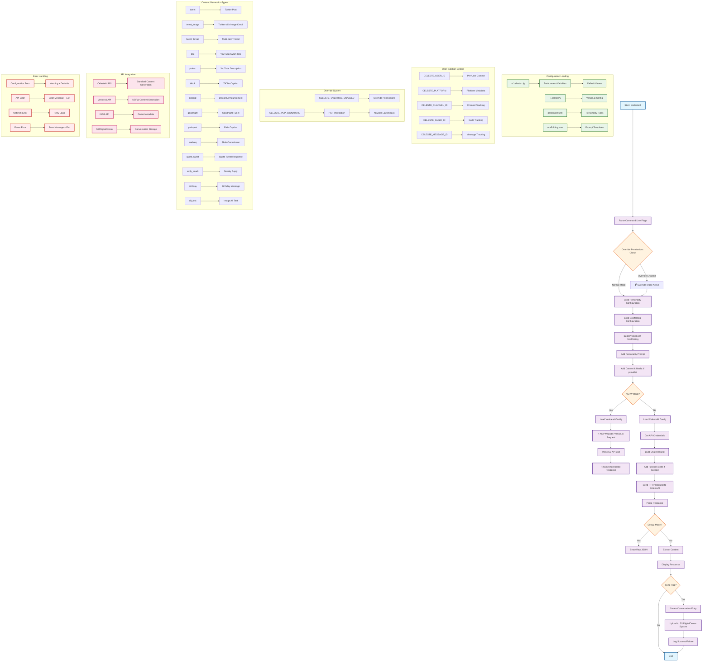

# CelesteCLI Function Calling Flow

## Mermaid Diagram



## Function Call Hierarchy

### 1. **Main Entry Point**
- `main()` - Entry point for CLI application
- `flag.Parse()` - Parse command line arguments
- `checkOverridePermissions()` - Check for override permissions

### 2. **Configuration Loading**
- `loadPersonalityConfig()` - Load personality.yml
- `loadScaffoldingConfig()` - Load scaffolding.json
- `loadVeniceConfig()` - Load Venice.ai configuration
- `readCelesteConfig()` - Load CelesteAI configuration

### 3. **Prompt Construction**
- `getPersonalityPrompt()` - Get personality-specific prompt
- `getScaffoldPrompt()` - Get content-type specific prompt
- Prompt assembly with context and media

### 4. **API Request Handling**
- `makeVeniceRequest()` - Handle Venice.ai requests (NSFW mode)
- Standard HTTP client for CelesteAI requests
- `createConversationEntry()` - Create conversation metadata

### 5. **Response Processing**
- JSON parsing and content extraction
- Debug mode handling
- Error handling and user feedback

### 6. **Storage Integration**
- `uploadConversationToS3()` - Upload to DigitalOcean Spaces
- `loadS3Config()` - Load S3 configuration
- Conversation metadata creation

### 7. **Utility Functions**
- `determineIntent()` - Determine conversation intent
- `determinePlatform()` - Determine platform context
- `determineSentiment()` - Analyze sentiment
- `extractTopics()` - Extract conversation topics
- `generateTags()` - Generate content tags
- `verifyPGPSignature()` - Verify PGP signatures

## Key Features

### **User Isolation System**
- Per-user conversation tracking via `CELESTE_USER_ID`
- Platform-specific metadata capture
- Channel, guild, and message ID tracking

### **Override Functionality**
- PGP signature verification for override commands
- Environment variable-based permission checking
- Audit logging for all override commands

### **Content Generation**
- 14 different content types supported
- External scaffolding system for easy template updates
- Personality-driven response generation

### **API Integration**
- CelesteAI for standard content generation
- Venice.ai for NSFW content generation
- IGDB for game metadata
- S3/DigitalOcean Spaces for conversation storage

### **Error Handling**
- Comprehensive error handling throughout
- Graceful fallbacks for configuration issues
- User-friendly error messages

## Usage Examples

### **Standard Content Generation**
```bash
./celestecli --type tweet --game "NIKKE" --tone "teasing"
```

### **NSFW Mode**
```bash
./celestecli --nsfw --type tweet --game "NIKKE" --tone "explicit"
```

### **Bot Integration**
```bash
CELESTE_USER_ID="discord_user_123" CELESTE_PLATFORM="discord" ./celestecli --type tweet --game "NIKKE" --tone "teasing" --sync
```

### **Override Commands**
```bash
CELESTE_OVERRIDE_ENABLED="true" CELESTE_PGP_SIGNATURE="kusanagi-abyss-override" ./celestecli --type tweet --game "NIKKE" --tone "explicit"
```

This flowchart provides a comprehensive overview of the CelesteCLI function calling architecture and can be used in documentation to help users understand the system's operation.
