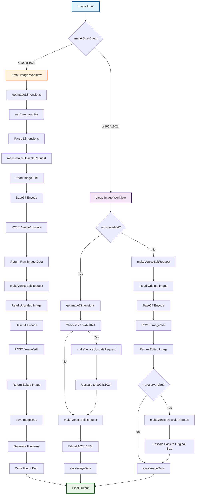
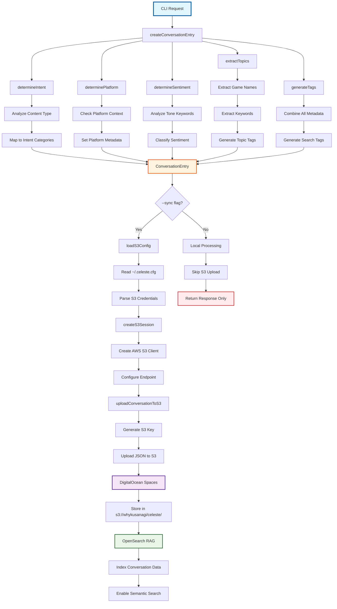
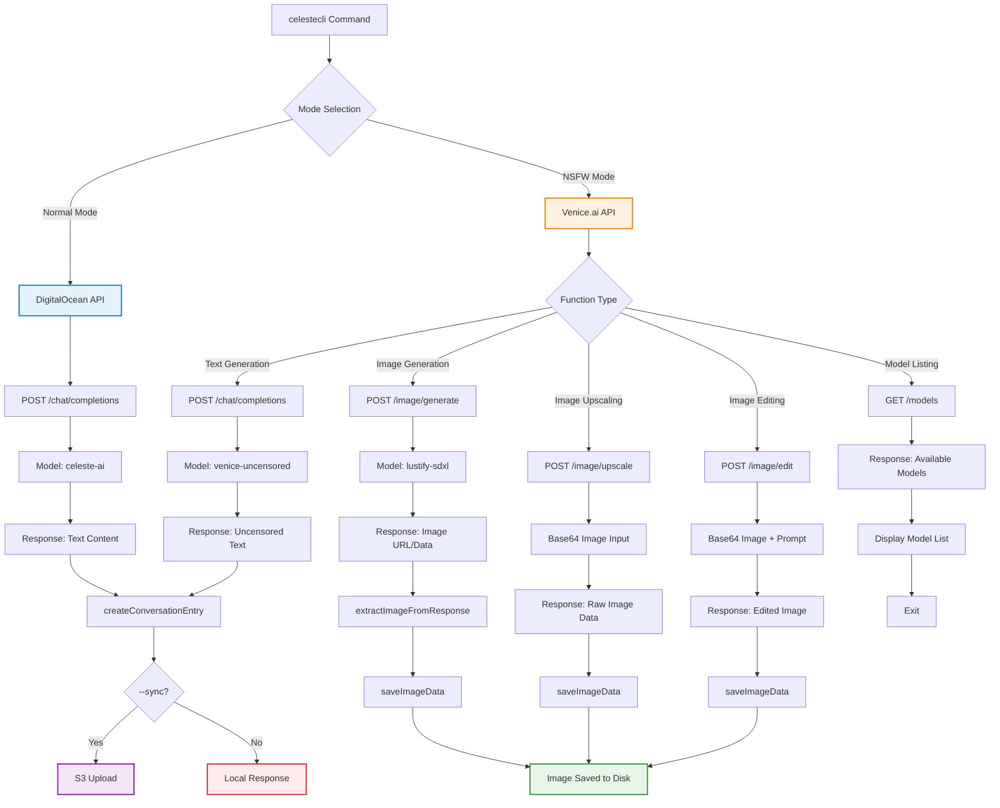
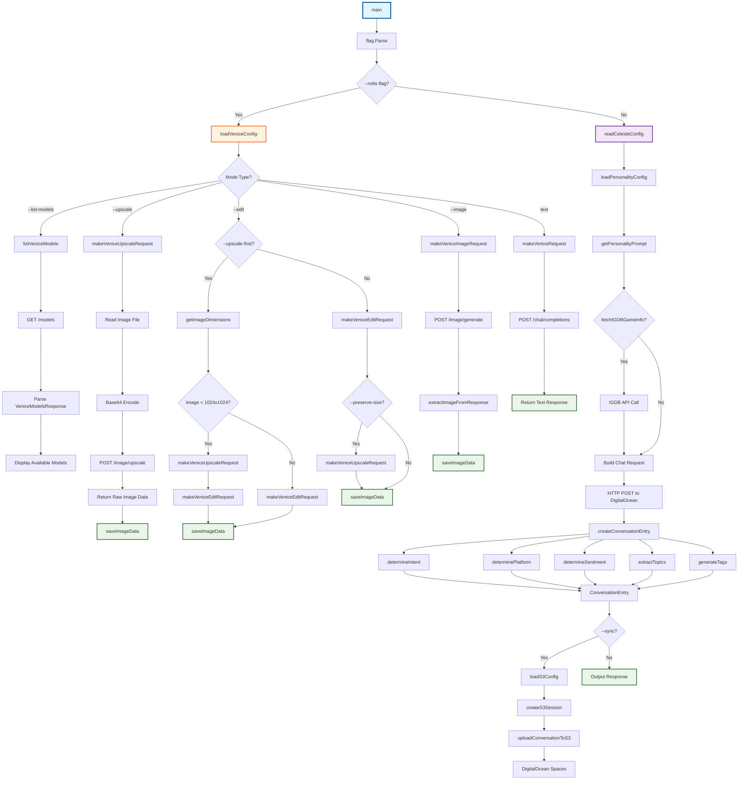

# CelesteCLI - CelesteAI Command Line Interface

A powerful Go-based CLI tool for interacting with CelesteAI, a mischievous demon noble VTuber assistant. This tool provides various content generation capabilities while maintaining Celeste's distinctive personality and voice, featuring content generation, image processing, and NSFW capabilities through Venice.ai integration.

## 🚀 Features

### Content Generation
- **Twitter/X Posts** - Generate tweets in Celeste's voice with proper hashtags and tone
- **YouTube Descriptions** - Create detailed video descriptions with game metadata from IGDB
- **Stream Titles** - Generate punchy, chaotic stream titles
- **Discord Announcements** - Create stream announcements for Discord
- **TikTok Captions** - Generate engaging short-form content captions
- **Pixiv Posts** - Generate artistic captions for illustrations
- **Skeb Requests** - Draft professional commission requests
- **Tarot Readings** - Generate mystical tarot readings with Celtic or three-card spreads
- **Goodnight Messages** - Create flirty or cozy goodnight tweets
- **Quote Tweets** - Generate witty quote tweet responses
- **Reply Snark** - Create snarky replies to tweets
- **Birthday Messages** - Generate celebratory birthday content
- **Alt Text** - Create descriptive image alt text

### Advanced Features
- **Personality System** - YAML-based personality configuration with multiple personas
- **IGDB Integration** - Automatic game metadata retrieval and caching
- **S3 Sync** - DigitalOcean Spaces integration for conversation storage and OpenSearch RAG
- **Bot Integration** - Discord/Twitch bot support with user isolation
- **Override Functionality** - PGP-signed override commands for bypassing restrictions
- **Scaffolding System** - External JSON configuration for prompt templates

### NSFW Mode (Venice.ai Integration)
- **Text Generation** - Uncensored content using `venice-uncensored` model
- **Image Generation** - NSFW image creation with `lustify-sdxl` model
- **Image Upscaling** - High-quality upscaling with fidelity controls
- **Image Editing** - Inpainting and signature removal
- **Smart Workflows** - Optimized 2-step process for small images

## 📦 Installation

### Prerequisites
- Go 1.19+
- Venice.ai API key (for NSFW features)
- DigitalOcean Spaces credentials (for S3 sync)

### Quick Install
```bash
git clone <repository>
cd celesteCLI
go build -o celestecli main.go scaffolding.go
./install.sh
```

### Manual Install
```bash
go build -o celestecli main.go scaffolding.go
cp celestecli ~/.local/bin/
chmod +x ~/.local/bin/celestecli
```

## ⚙️ Configuration

### CelesteAI Configuration (`~/.celesteAI`)

Create a `~/.celesteAI` config file with:
```bash
# CelesteAI API
endpoint=https://your-celeste-api-endpoint
api_key=your-api-key

# IGDB Integration
client_id=your-igdb-client-id
secret=your-igdb-client-secret

# NSFW Mode (Venice.ai)
venice_api_key=your-venice-api-key
venice_base_url=https://api.venice.ai/api/v1
venice_model=venice-uncensored
venice_upscaler=upscaler
```

Or set environment variables:
- `CELESTE_API_ENDPOINT`
- `CELESTE_API_KEY`
- `CELESTE_IGDB_CLIENT_ID`
- `CELESTE_IGDB_CLIENT_SECRET`
- `VENICE_API_KEY` (for NSFW mode)

### DigitalOcean Spaces Configuration (`~/.celeste.cfg`)

Create a `~/.celeste.cfg` config file with:
```bash
# DigitalOcean Spaces
endpoint=https://sfo3.digitaloceanspaces.com
bucket_name=whykusanagi
access_key_id=your-access-key
secret_access_key=your-secret-key
region=sfo3
```

Or set environment variables:
- `DO_SPACES_ACCESS_KEY_ID`
- `DO_SPACES_SECRET_ACCESS_KEY`

## 🎯 Usage

### Basic Content Generation

```bash
# Twitter post
celestecli --type tweet --game "NIKKE" --tone "lewd"

# TikTok caption
celestecli --type tiktok --tone "playful"

# YouTube description
celestecli --type ytdesc --game "Streaming" --tone "professional"

# Stream title
celestecli --type title --game "Schedule I" --tone "dramatic"

# Discord announcement
celestecli --type discord --game "Blue Archive" --tone "hype"

# Pixiv post caption
celestecli --type pixivpost --game "Fall of Kirara" --tone "dramatic"

# Skeb commission request
celestecli --type skebreq --game "Celeste" --tone "professional" --context "bunny outfit"

# Tarot reading
celestecli --type tarot --spread celtic

# Goodnight message
celestecli --type goodnight --tone "sweet teasing"

# Quote tweet
celestecli --type quote_tweet --tone "snarky"

# Reply snark
celestecli --type reply_snark --tone "witty"

# Birthday message
celestecli --type birthday --tone "celebratory"

# Alt text
celestecli --type alt_text --context "image description"
```

### Advanced Options

```bash
# Generate content with specific persona
celestecli --type tweet --persona celeste_ad_read --tone "wink-and-nudge" --game "NIKKE"

# Generate content with media context
celestecli --type tweet --media "https://example.com/image.jpg" --tone "teasing"

# Generate content with additional context
celestecli --type ytdesc --context "This is a special stream event" --game "NIKKE"

# Upload conversation to OpenSearch
celestecli --type tweet --sync --game "NIKKE"

# Enable debug mode
celestecli --type tweet --debug
```

### NSFW Mode

```bash
# Uncensored text generation
celestecli --nsfw --context "Generate explicit content"
celestecli --nsfw --type tweet --tone "explicit" --game "NIKKE"
celestecli --nsfw --type tiktok --tone "lewd" --game "NIKKE"
celestecli --nsfw --type ytdesc --tone "adult" --game "NIKKE"

# Image generation
celestecli --nsfw --image --context "Generate NSFW image of Celeste"

# Image upscaling
celestecli --nsfw --upscale --image-path "image.png"

# Image editing (signature removal)
celestecli --nsfw --edit --image-path "image.png" --edit-prompt "remove signature"

# Optimized workflow for small images
celestecli --nsfw --edit --image-path "small_image.png" --edit-prompt "remove watermark" --upscale-first

# List available Venice.ai models
celestecli --nsfw --list-models

# Override model
celestecli --nsfw --model "wai-Illustrious" --image --context "Anime style"

# Custom output filename
celestecli --nsfw --image --output "my_image.png" --context "Custom filename"

# Preserve original size
celestecli --nsfw --edit --image-path "large_image.png" --edit-prompt "edit" --preserve-size
```

## 📋 Content Types

| Type | Description | Max Length | Platform |
|------|-------------|------------|----------|
| `tweet` | Twitter post | 280 | Twitter |
| `tweet_image` | Twitter post with image credit | 280 | Twitter |
| `tweet_thread` | Multi-part Twitter thread | 280 | Twitter |
| `title` | Stream title | 140 | Streaming |
| `ytdesc` | YouTube description | 5000 | YouTube |
| `tiktok` | TikTok caption | 2200 | TikTok |
| `discord` | Discord announcement | 2000 | Discord |
| `goodnight` | Goodnight message | 280 | Twitter |
| `pixivpost` | Pixiv post caption | 1000 | Pixiv |
| `skebreq` | Skeb commission request | 900 | Skeb |
| `quote_tweet` | Quote tweet response | 280 | Twitter |
| `reply_snark` | Snarky reply | 280 | Twitter |
| `birthday` | Birthday message | 280 | Twitter |
| `alt_text` | Image alt text | 125 | Accessibility |

## 🎨 Tone Examples

- `lewd` - Suggestive and teasing
- `explicit` - Direct and uncensored (NSFW mode)
- `teasing` - Playful and mischievous
- `chaotic` - Wild and unpredictable
- `cute` - Sweet and endearing
- `official` - Professional and formal
- `dramatic` - Intense and emotional
- `parody` - Humorous and satirical
- `funny` - Comedy and entertainment
- `suggestive` - Hinting and playful
- `adult` - Mature and sophisticated
- `sweet` - Gentle and caring
- `snarky` - Sarcastic and witty
- `playful` - Fun and lighthearted
- `hype` - Energetic and exciting

## 🎭 Personality System

### Configuration (`personality.yml`)
- **Personas**: Multiple character modes (stream, moderation, etc.)
- **Content Types**: Specialized templates for different platforms
- **Voice Rules**: Tone and style guidelines
- **Safety Modes**: Content filtering and guardrails

### Available Personas
- `celeste_stream` - Default streaming persona (teasing, smug, mischievous, playful)
- `celeste_ad_read` - Advertisement reading persona (wink-and-nudge, promotional, engaging)
- `celeste_moderation_warning` - Moderation warning persona (authoritative, clear, firm but fair)

## 🚨 NSFW Mode Details

### Venice.ai Models
- **Text**: `venice-uncensored` - Uncensored text generation
- **Images**: `lustify-sdxl` - NSFW image generation
- **Anime**: `wai-Illustrious` - Anime-style generation
- **Upscaling**: `upscaler` - High-quality upscaling (2x $0.02, 4x $0.08)

### API Endpoints
- `/image/generate` - Image generation
- `/image/upscale` - Image upscaling
- `/image/edit` - Image editing/inpainting
- `/models` - List available models

### Quality Controls
- **Conservative Settings**: 0.05 creativity, 0.9 replication
- **Fidelity Prompts**: "preserve original details exactly"
- **Smart Workflows**: Automatic optimization based on image size

## 🎨 Image Processing Workflows

### Image Processing Pipeline



### Standard Upscaling
- **Input**: Any image ≥256x256 pixels
- **Output**: 2x upscaled with quality preservation
- **Parameters**: Conservative settings for fidelity

### Smart Editing Workflow
- **Small Images** (<1024x1024): Uses `--upscale-first` (2 API calls)
  1. Upscale to 1024x1024
  2. Edit at native size
- **Large Images** (≥1024x1024): Uses standard edit workflow
- **Result**: High-quality edited images without distortion

### Quality Controls
- **Enhancement Creativity**: 0.0-1.0 (lower = more faithful)
- **Replication Level**: 0.0-1.0 (higher = more faithful)
- **Enhancement Prompt**: Custom instructions for upscaling

## 🤖 Bot Integration

### Environment Variables
```bash
export CELESTE_USER_ID="user123"
export CELESTE_PLATFORM="discord"
export CELESTE_CHANNEL_ID="channel123"
export CELESTE_GUILD_ID="guild123"
export CELESTE_OVERRIDE_ENABLED="true"
export CELESTE_PGP_SIGNATURE="signature"
```

### User Isolation
- Each user gets separate conversation contexts
- Platform-specific metadata tracking
- PGP signature verification for override commands

### Usage Examples
```bash
# Discord bot integration
CELESTE_USER_ID="discord_user_123" CELESTE_PLATFORM="discord" celestecli --type tweet --game "NIKKE" --tone "teasing" --sync

# Twitch bot integration  
CELESTE_USER_ID="twitch_user_456" CELESTE_PLATFORM="twitch" celestecli --type tweet --game "NIKKE" --tone "chaotic" --sync

# PGP-signed override commands
CELESTE_OVERRIDE_ENABLED="true" CELESTE_PGP_SIGNATURE="kusanagi-abyss-override" celestecli --type tweet --game "NIKKE" --tone "explicit"
```

## 📊 S3 Integration & RAG

### Data Flow Architecture



### API Endpoint Flow



### Conversation Storage
- **Format**: Structured JSON with intent, purpose, topics
- **Location**: `s3://whykusanagi/celeste/conversations/`
- **Metadata**: User ID, platform, sentiment, success tracking

### Data Structure
```json
{
  "id": "conversation_id",
  "timestamp": "2024-01-01T00:00:00Z",
  "content_type": "tweet",
  "tone": "teasing",
  "game": "NIKKE",
  "persona": "celeste_stream",
  "prompt": "user_prompt",
  "response": "ai_response",
  "intent": "social_media",
  "purpose": "tweet",
  "topics": ["nikke", "gaming"],
  "sentiment": "positive",
  "platform": "twitter",
  "tags": ["celeste", "ai", "content"],
  "context": "Game: NIKKE, Tone: teasing, Persona: celeste_stream",
  "success": true
}
```

### S3 Path Structure
```
s3://whykusanagi/celeste/conversations/
├── 1760832573516177000.json
├── 1760832573516177001.json
└── ...
```

### OpenSearch Integration
- **Purpose**: RAG (Retrieval-Augmented Generation)
- **Data Structure**: Intent-based organization
- **Benefits**: Contextual responses based on conversation history

## 🏗️ Scaffolding System

The CLI uses an external JSON configuration system for prompt templates:

### Configuration File: `scaffolding.json`
```json
{
  "content_types": {
    "tweet": {
      "description": "Write a post for X/Twitter",
      "scaffold": "🐦 Write a Twitter post in CelesteAI's voice...",
      "max_length": 280,
      "platform": "twitter"
    }
  },
  "tone_examples": {
    "lewd": "suggestive and teasing",
    "explicit": "direct and uncensored"
  },
  "platforms": {
    "twitter": {
      "max_length": 280,
      "hashtags": ["#CelesteAI", "#KusanagiAbyss", "#VTuberEN"],
      "emoji_usage": "1-2 per sentence"
    }
  }
}
```

### Benefits
- ✅ **No Code Changes**: Update templates via JSON
- ✅ **Easy Extension**: Add new content types
- ✅ **Platform Support**: Configure platform-specific settings
- ✅ **Maintainable**: Clear separation of data and logic

### Adding New Content Types

1. **Update `scaffolding.json`**:
```json
{
  "content_types": {
    "new_type": {
      "description": "Description of new content type",
      "scaffold": "Prompt template for new content type",
      "max_length": 280,
      "platform": "twitter"
    }
  }
}
```

2. **Update help menu in `main.go`** (if needed)
3. **Test the new content type**

### Adding New Platforms

1. **Update `scaffolding.json`**:
```json
{
  "platforms": {
    "new_platform": {
      "max_length": 500,
      "hashtags": ["#CelesteAI"],
      "emoji_usage": "1-2 per sentence"
    }
  }
}
```

2. **Update platform detection logic** (if needed)

## 🔧 Development

### Function Call Flow



### Technical Architecture

```mermaid
graph TB
    subgraph "CLI Interface Layer"
        A[celestecli main] --> B[flag.Parse]
        B --> C[Configuration Loading]
        C --> D[readCelesteConfig]
        C --> E[loadPersonalityConfig]
        C --> F[loadVeniceConfig]
        C --> G[loadS3Config]
    end
    
    subgraph "Configuration Files"
        H[~/.celesteAI<br/>DigitalOcean API]
        I[~/.celeste.cfg<br/>S3 Credentials]
        J[personality.yml<br/>Celeste Personality]
    end
    
    subgraph "Normal Mode Processing"
        K[getPersonalityPrompt] --> L[fetchIGDBGameInfo]
        L --> M[Build Chat Request]
        M --> N[HTTP POST to DigitalOcean]
        N --> O[createConversationEntry]
        O --> P[determineIntent]
        O --> Q[determinePlatform]
        O --> R[determineSentiment]
        O --> S[extractTopics]
        O --> T[generateTags]
    end
    
    subgraph "NSFW Mode (Venice.ai)"
        U[makeVeniceRequest] --> V[POST /chat/completions]
        W[makeVeniceImageRequest] --> X[POST /image/generate]
        Y[makeVeniceUpscaleRequest] --> Z[POST /image/upscale]
        AA[makeVeniceEditRequest] --> BB[POST /image/edit]
        CC[listVeniceModels] --> DD[GET /models]
    end
    
    subgraph "Image Processing Pipeline"
        EE[getImageDimensions] --> FF{Image Size Check}
        FF -->|Small| GG[makeVeniceUpscaleRequest]
        FF -->|Large| HH[makeVeniceEditRequest]
        GG --> HH
        HH --> II[saveImageData]
        JJ[extractImageFromResponse] --> II
    end
    
    subgraph "Data Persistence Layer"
        KK[uploadConversationToS3] --> LL[createS3Session]
        LL --> MM[DigitalOcean Spaces]
        MM --> NN[OpenSearch RAG]
    end
    
    subgraph "Bot Integration Layer"
        OO[Discord Bot] --> PP[User Isolation]
        QQ[Twitch Bot] --> PP
        PP --> RR[verifyPGPSignature]
        RR --> SS[checkOverridePermissions]
    end
    
    A --> K
    A --> U
    A --> W
    A --> Y
    A --> AA
    A --> CC
    A --> KK
    A --> OO
    A --> QQ
    
    D --> H
    E --> J
    F --> H
    G --> I
    
    style A fill:#e1f5fe,stroke:#01579b,stroke-width:3px
    style U fill:#fff3e0,stroke:#e65100,stroke-width:2px
    style W fill:#fff3e0,stroke:#e65100,stroke-width:2px
    style Y fill:#fff3e0,stroke:#e65100,stroke-width:2px
    style AA fill:#fff3e0,stroke:#e65100,stroke-width:2px
    style CC fill:#fff3e0,stroke:#e65100,stroke-width:2px
    style KK fill:#f3e5f5,stroke:#4a148c,stroke-width:2px
    style OO fill:#e8f5e8,stroke:#1b5e20,stroke-width:2px
    style QQ fill:#e8f5e8,stroke:#1b5e20,stroke-width:2px
```



### Project Structure
```
celesteCLI/
├── main.go              # Core CLI application
├── scaffolding.go       # Prompt template loader
├── scaffolding.json     # Prompt templates
├── personality.yml      # Celeste personality configuration
├── go.mod              # Go dependencies
├── go.sum              # Dependency checksums
├── install.sh          # Installation script
└── README.md           # This file
```

### Dependencies
- `github.com/aws/aws-sdk-go` - S3 integration
- `github.com/sashabaranov/go-openai` - Venice.ai integration
- `gopkg.in/yaml.v3` - YAML configuration parsing

### Building
```bash
go mod tidy
go build -o celestecli main.go scaffolding.go
```

## 🔍 Troubleshooting

### Common Issues

1. **Missing API Key**
   ```
   Missing CELESTE_API_ENDPOINT or CELESTE_API_KEY
   ```
   **Solution**: Set environment variables or update `~/.celesteAI`

2. **Venice.ai Configuration Error**
   ```
   Venice.ai configuration error: missing Venice.ai API key
   ```
   **Solution**: Set `VENICE_API_KEY` or add `venice_api_key` to `~/.celesteAI`

3. **S3 Upload Failed**
   ```
   Warning: Failed to upload conversation to S3
   ```
   **Solution**: Check DigitalOcean Spaces credentials in `~/.celeste.cfg`

4. **Image Dimension Errors**
   - Ensure images meet minimum requirements (256x256)
   - Check file permissions and PATH configuration

### Debug Mode
```bash
celestecli --debug --type tweet --context "Debug output"
```

## 📈 Performance

### API Call Optimization
- **Standard Edit**: 1 API call
- **Upscale-First**: 2 API calls (optimized)
- **Previous Workflow**: 3 API calls (deprecated)

### Timing Examples
- **Text Generation**: ~2-5 seconds
- **Image Generation**: ~10-15 seconds
- **Image Upscaling**: ~8-12 seconds
- **Smart Editing**: ~14-20 seconds

## 🔒 Security

### PGP Signature Verification
- Override commands require PGP signatures
- Keybase integration for signature verification
- Environment variable configuration

### Content Safety
- Platform-specific content filtering
- Age-gated content handling
- Moderation capabilities for Discord/Twitch

## 📝 License

This project is part of the CelesteAI ecosystem. See individual component licenses for details.

## 🤝 Contributing

1. Fork the repository
2. Create a feature branch
3. Make your changes
4. Test thoroughly
5. Submit a pull request

## 📞 Support

For issues and questions:
- Check the troubleshooting section
- Review configuration examples
- Test with debug mode enabled
- Verify API endpoint status
