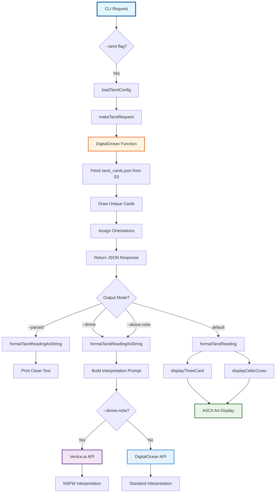
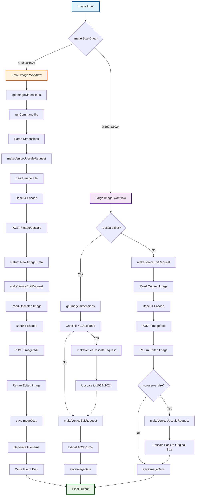
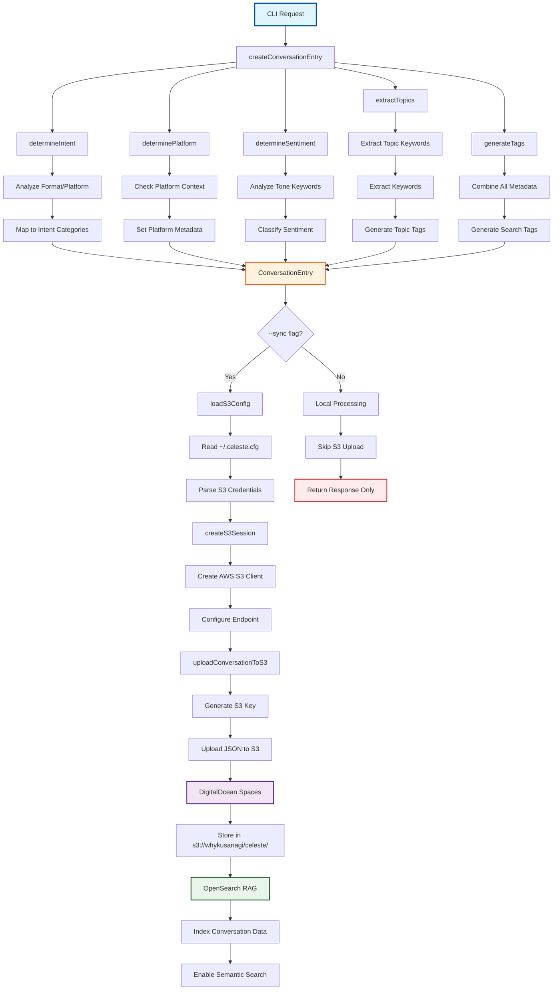
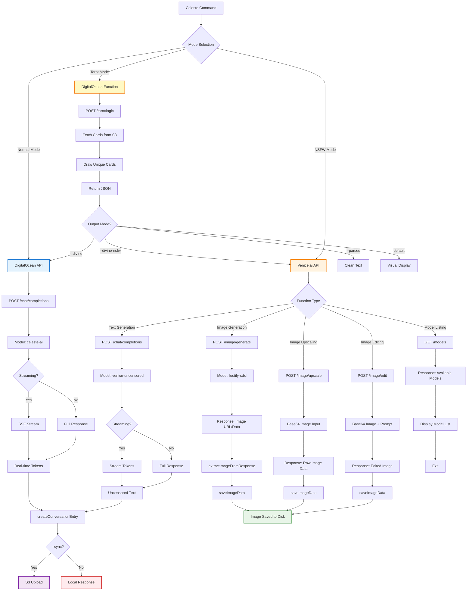
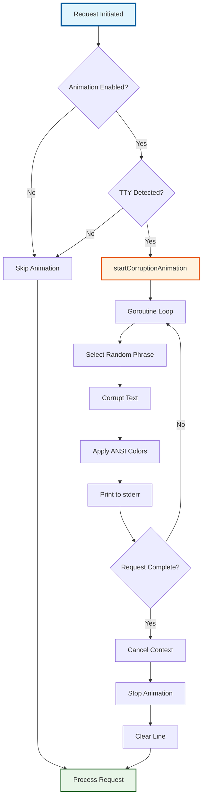
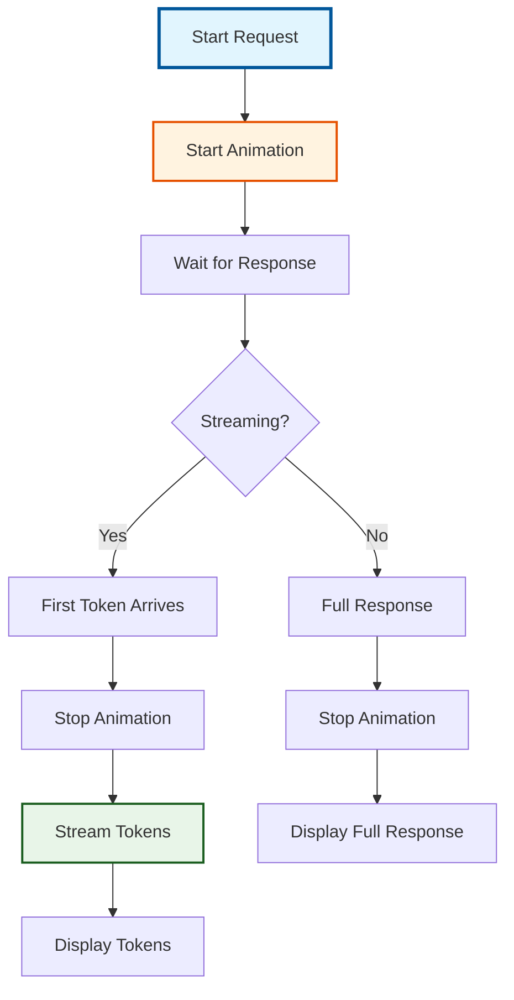
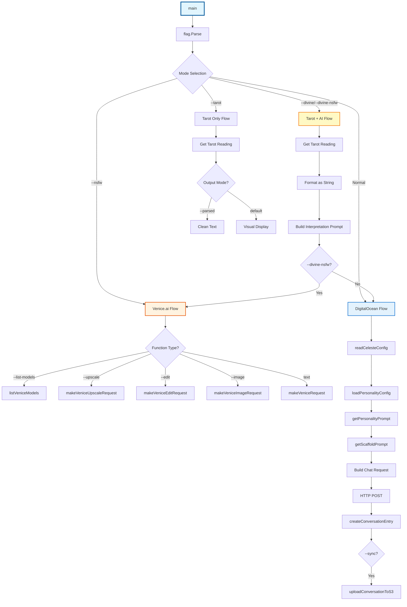

# Celeste - Premium AI Content Generation CLI

A premium, corruption-aesthetic command-line interface for CelesteAI, a mischievous demon noble VTuber assistant. Designed with Apple-quality polish but twisted by the abyss, featuring real-time demonic eye animations showing when Celeste is thinking, color-coded feedback, and premium visual design. Advanced content generation, image processing, tarot readings, and NSFW capabilities through Venice.ai integration—all with embedded pixel art assets.

## 🚀 Features

### Content Generation
- **Format-Based System** - Flexible content generation with `short`, `long`, or `general` formats
- **Platform Support** - Twitter, TikTok, YouTube, Discord with platform-specific optimizations
- **Topic-Based Content** - Generate content about games, events, or any topic
- **Direct Instructions** - Use `--request` for specific content requirements
- **Streaming Responses** - Real-time token streaming for immediate feedback
- **Visual Feedback** - Corruption animation during processing

### Tarot Readings
- **Three Card Spread** - Past, Present, Future readings
- **Celtic Cross Spread** - 10-card comprehensive readings
- **Visual Display** - Beautiful ASCII art card layouts
- **Parsed Output** - Clean format for AI consumption
- **Divine Interpretation** - Automatic AI interpretation of readings
- **NSFW Interpretations** - Uncensored tarot analysis via Venice.ai

### Advanced Features
- **Personality System** - YAML-based personality configuration with multiple personas
- **S3 Sync** - DigitalOcean Spaces integration for conversation storage and OpenSearch RAG
- **Bot Integration** - Discord/Twitch bot support with user isolation
- **Override Functionality** - PGP-signed override commands for bypassing restrictions
- **Scaffolding System** - External JSON configuration for prompt templates

### NSFW Mode (Venice.ai Integration)
- **Text Generation** - Uncensored content using `venice-uncensored` model
- **Image Generation** - NSFW image creation with `lustify-sdxl` model
- **Image Upscaling** - High-quality upscaling with fidelity controls
- **Image Editing** - Inpainting and signature removal
- **Smart Workflows** - Optimized 2-step process for small images

### Twitter Integration
- **Direct Posting** - Generate and post content to Twitter in one command
- **Tweet Download** - Fetch all your tweets for analysis and learning
- **Style Learning** - Store downloaded tweets in S3 for Celeste to learn your posting patterns
- **Metadata Tracking** - Automatically track tweet IDs and engagement metrics
- **Date Filtering** - Download tweets within specific date ranges

### Premium UI/UX
- **Demonic Eye Animation** - Shows when Celeste is thinking/processing (similar to Claude's sparkle indicator)
- **Color-Coded Messages** - Info (cyan), Success (green), Warnings (yellow), Errors (red)
- **Operation Phases** - Real-time feedback on what step is currently executing
- **Processing Indicators** - Premium spinners and animations showing active operations
- **Error Resolution Boxes** - Formatted error messages with helpful hints and documentation links
- **Apple-Quality Design** - Premium, clean interface with consistent visual language but corrupted by the abyss
- **Mode-Specific Colors** - TAROT (magenta), NSFW (yellow), Twitter (blue), Normal (cyan)
- **Configuration Headers** - Shows active settings before processing begins
- **Success Footers** - Operation metrics displayed after completion

### Embedded Assets
- **Portable Binary** - Pixel art assets embedded directly in executable (no external files needed)
- **Pixel Art Support** - High-quality Celeste and Kusanagi pixel animations
- **Terminal Display** - ASCII art representation with graceful fallback support
- **Base64 Export** - Assets available for API/export use

## 📦 Installation

### Prerequisites
- Go 1.19+
- Venice.ai API key (for NSFW features)
- DigitalOcean Spaces credentials (for S3 sync)

### Quick Install
```bash
git clone https://github.com/whykusanagi/celesteCLI.git
cd celesteCLI
go build -o Celeste main.go scaffolding.go animation.go ui.go assets.go
./install.sh
```

### Manual Install
```bash
go build -o Celeste main.go scaffolding.go animation.go ui.go assets.go
sudo cp Celeste /usr/local/bin/
chmod +x /usr/local/bin/Celeste
```

### Verify Installation
```bash
which Celeste
Celeste -h
```

## ⚙️ Configuration

### CelesteAI Configuration (`~/.celesteAI`)

Create a `~/.celesteAI` config file with:
```bash
# CelesteAI API
endpoint=https://your-celeste-api-endpoint
api_key=your-api-key

# Tarot Function (DigitalOcean)
tarot_function_url=https://your-tarot-function-url
tarot_auth_token=Basic your-auth-token

# NSFW Mode (Venice.ai)
venice_api_key=your-venice-api-key
venice_base_url=https://api.venice.ai/api/v1
venice_model=venice-uncensored
venice_upscaler=upscaler
```

Or set environment variables:
- `CELESTE_API_ENDPOINT`
- `CELESTE_API_KEY`
- `TAROT_FUNCTION_URL`
- `TAROT_AUTH_TOKEN`
- `VENICE_API_KEY` (for NSFW mode)

### DigitalOcean Spaces Configuration (`~/.celeste.cfg`)

Create a `~/.celeste.cfg` config file with:
```bash
# DigitalOcean Spaces
endpoint=https://sfo3.digitaloceanspaces.com
bucket_name=whykusanagi
access_key_id=your-access-key
secret_access_key=your-secret-key
region=sfo3
```

Or set environment variables:
- `DO_SPACES_ACCESS_KEY_ID`
- `DO_SPACES_SECRET_ACCESS_KEY`

### Twitter API Configuration (Optional)

Add to `~/.celesteAI` to enable Twitter integration:
```bash
# Twitter API - Bearer Token required, others optional
twitter_bearer_token=your-bearer-token
twitter_api_key=your-api-key
twitter_api_secret=your-api-secret
twitter_access_token=your-access-token
twitter_access_token_secret=your-access-token-secret
```

Or set environment variables:
- `TWITTER_BEARER_TOKEN` (required for Twitter features)
- `TWITTER_API_KEY`
- `TWITTER_API_SECRET`
- `TWITTER_ACCESS_TOKEN`
- `TWITTER_ACCESS_TOKEN_SECRET`

**How to get Twitter credentials:**
1. Visit [Twitter Developer Portal](https://developer.twitter.com/en/portal/dashboard)
2. Create or select an app
3. Go to "Keys and tokens" section
4. Generate/copy your Bearer Token (required)
5. Optionally generate API Key, Secret, Access Token, and Access Token Secret

## 🎨 UI/UX Features

### Demonic Eye Animation
When Celeste is thinking or processing, you'll see a demonic eye animation similar to Claude's sparkle indicator:
```
[●●] Processing... 1b55tful 4byss...
```

This shows that an agent is actively working and thinking. The eye pulses with different frames and colors:
- **Magenta pulse**: Normal operation
- **Red pulse**: Error or warning state
- **Looking left/right**: Different processing modes

### Color-Coded Messages
All CLI messages use consistent colors for quick understanding:

```
📋 INFO messages - Cyan
✅ SUCCESS messages - Green
⚠️  WARNING messages - Yellow
❌ ERROR messages - Bright Red
🔍 DEBUG messages - Cyan
```

### Mode-Specific Styling
Different operation modes have distinct visual themes:

```
[TAROT]    🔮 Magenta theme for mystical divination
[NSFW]     ⚡ Yellow theme for NSFW operations
[TWITTER]  🐦 Blue theme for social media
[NORMAL]   ✨ Cyan theme for standard generation
```

### Operation Phases
Long-running operations show real-time progress:

```
[✓] Config loaded
[✓] Personality loaded
[●] Building prompt...
[ ] Generating...
```

### Error Resolution Boxes
Errors are displayed in formatted boxes with helpful hints:

```
╔══════════════════════════════════════════╗
║ ❌ Missing Twitter Bearer Token         ║
╟──────────────────────────────────────────╢
║ HOW TO FIX:                             ║
║ 1. Visit: https://developer.twitter.com ║
║ 2. Generate Bearer Token                ║
║ 3. Add to ~/.celesteAI:                 ║
║    twitter_bearer_token=your_token      ║
║                                          ║
║ 📖 Docs: https://docs.Celeste.io    ║
╚══════════════════════════════════════════╝
```

## 🎯 Usage

### Basic Content Generation

The CLI uses a format-based system for flexible content generation:

```bash
# Short format (280 chars) for Twitter
Celeste --format short --platform twitter --topic "NIKKE" --tone "lewd"

# Long format (5000 chars) for YouTube
Celeste --format long --platform youtube --topic "Streaming" --request "include links to website, socials, products"

# General format (flexible length)
Celeste --format general --platform discord --topic "Gaming" --tone "chaotic"

# With direct instructions
Celeste --format short --platform twitter --topic "NIKKE" --tone "lewd" --request "write about Viper character"
```

### Format Options

- `short` - 280 characters (Twitter, short posts)
- `long` - 5000 characters (YouTube descriptions, detailed content)
- `general` - Flexible length based on platform and context

### Platform Options

- `twitter` - Twitter/X posts with hashtags
- `tiktok` - TikTok captions
- `youtube` - YouTube descriptions
- `discord` - Discord announcements

### Advanced Options

```bash
# Generate content with specific persona
Celeste --format short --platform twitter --persona celeste_ad_read --tone "wink-and-nudge" --topic "NIKKE"

# Generate content with media context
Celeste --format short --platform twitter --media "https://example.com/image.jpg" --tone "teasing"

# Generate content with additional context
Celeste --format long --platform youtube --context "This is a special stream event" --topic "NIKKE"

# Upload conversation to OpenSearch
Celeste --format short --platform twitter --sync --topic "NIKKE"

# Enable debug mode
Celeste --format short --platform twitter --debug

# Disable streaming
Celeste --format short --platform twitter --no-stream

# Disable animation
Celeste --format short --platform twitter --no-animation
```

### Tarot Readings

```bash
# Three card spread (default)
Celeste --tarot

# Celtic Cross spread (10 cards)
Celeste --tarot --spread celtic

# Parsed output for AI consumption
Celeste --tarot --parsed

# Automatic AI interpretation (standard)
Celeste --divine

# Automatic AI interpretation (NSFW)
Celeste --divine-nsfw

# Celtic spread with AI interpretation
Celeste --divine --spread celtic
```

### NSFW Mode

```bash
# Uncensored text generation
Celeste --nsfw --format short --platform twitter --topic "NIKKE" --tone "explicit" --request "write about character interactions"

# Image generation
Celeste --nsfw --image --request "Generate NSFW image of Celeste"

# Image upscaling
Celeste --nsfw --upscale --image-path "image.png"

# Image editing (signature removal)
Celeste --nsfw --edit --image-path "image.png" --edit-prompt "remove signature"

# Optimized workflow for small images
Celeste --nsfw --edit --image-path "small_image.png" --edit-prompt "remove watermark" --upscale-first

# List available Venice.ai models
Celeste --nsfw --list-models

# Override model
Celeste --nsfw --model "wai-Illustrious" --image --request "Anime style"

# Custom output filename
Celeste --nsfw --image --output "my_image.png" --request "Custom filename"

# Preserve original size
Celeste --nsfw --edit --image-path "large_image.png" --edit-prompt "edit" --preserve-size
```

### Twitter Integration

Post generated content directly to Twitter and download your tweets for analysis:

```bash
# Generate content and post to Twitter
Celeste --format short --platform twitter --topic "NIKKE" --twitter-post

# Generate content and post with specific tone
Celeste --format short --platform twitter --topic "Game Discussion" --tone "teasing" --twitter-post

# Download your tweets for learning
Celeste --twitter-user "@yourusername" --twitter-count 500

# Download tweets with date filtering
Celeste --twitter-user "@yourusername" --twitter-count 1000 --twitter-since "2024-01-01T00:00:00Z"

# Download and store tweets in S3 for Celeste to learn your style
Celeste --twitter-user "@yourusername" --twitter-count 500 --twitter-learn --sync

# Generate content aware of your posting style (requires downloaded tweets in S3)
Celeste --format short --platform twitter --topic "New Topic" --context "similar to my tweets" --twitter-post
```

#### Twitter Setup

1. **Get API Credentials**: Go to [Twitter Developer Portal](https://developer.twitter.com/en/portal/dashboard) and create an app
2. **Generate Tokens**: Get your:
   - Bearer Token (required for API v2)
   - API Key & Secret (optional)
   - Access Token & Secret (optional)

3. **Configure**: Add to `~/.celesteAI`:
```bash
# Twitter API (required: bearer_token, optional: api_key, api_secret, access_token, access_token_secret)
twitter_bearer_token=your-bearer-token
twitter_api_key=your-api-key
twitter_api_secret=your-api-secret
twitter_access_token=your-access-token
twitter_access_token_secret=your-access-token-secret
```

Or use environment variables:
- `TWITTER_BEARER_TOKEN` (required)
- `TWITTER_API_KEY`
- `TWITTER_API_SECRET`
- `TWITTER_ACCESS_TOKEN`
- `TWITTER_ACCESS_TOKEN_SECRET`

#### Twitter Flags

- `--twitter-post` - Post generated content to Twitter
- `--twitter-user <username>` - Download tweets from user (e.g., `@yourusername`)
- `--twitter-count <n>` - Maximum tweets to download (default: 100, max: limited by API)
- `--twitter-since <date>` - Filter tweets by start date (ISO 8601 format)
- `--twitter-until <date>` - Filter tweets by end date (ISO 8601 format)
- `--twitter-include-replies` - Include replies in downloads
- `--twitter-learn` - Store downloaded tweets in S3 for RAG/learning (requires `--sync`)

## 🎨 Tone Examples

- `lewd` - Suggestive and teasing
- `explicit` - Direct and uncensored (NSFW mode)
- `teasing` - Playful and mischievous
- `chaotic` - Wild and unpredictable
- `cute` - Sweet and endearing
- `official` - Professional and formal
- `dramatic` - Intense and emotional
- `parody` - Humorous and satirical
- `funny` - Comedy and entertainment
- `suggestive` - Hinting and playful
- `adult` - Mature and sophisticated
- `sweet` - Gentle and caring
- `snarky` - Sarcastic and witty
- `playful` - Fun and lighthearted
- `hype` - Energetic and exciting

## 🎭 Personality System

### Configuration (`personality.yml`)
- **Personas**: Multiple character modes (stream, moderation, etc.)
- **Content Types**: Specialized templates for different platforms
- **Voice Rules**: Tone and style guidelines
- **Safety Modes**: Content filtering and guardrails

### Available Personas
- `celeste_stream` - Default streaming persona (teasing, smug, mischievous, playful)
- `celeste_ad_read` - Advertisement reading persona (wink-and-nudge, promotional, engaging)
- `celeste_moderation_warning` - Moderation warning persona (authoritative, clear, firm but fair)

## 🔮 Tarot System

### Architecture



### Spread Types

- **Three Card Spread** - Past, Present, Future
- **Celtic Cross Spread** - 10-card comprehensive reading with positions:
  1. Present Situation
  2. Challenge/Opposition
  3. Distant Past
  4. Recent Past
  5. Possible Future
  6. Near Future
  7. Your Approach
  8. External Influences
  9. Hopes/Fears
  10. Final Outcome

### Card Metadata

Cards are fetched from S3 (`tarot_cards.json`) and include:
- Card name
- Upright meaning
- Reversed meaning
- Suit/Arcana
- Element, Planet, Zodiac associations
- Symbol and color information

## 🚨 NSFW Mode Details

### Venice.ai Models
- **Text**: `venice-uncensored` - Uncensored text generation
- **Images**: `lustify-sdxl` - NSFW image generation
- **Anime**: `wai-Illustrious` - Anime-style generation
- **Upscaling**: `upscaler` - High-quality upscaling (2x $0.02, 4x $0.08)

### API Endpoints
- `/image/generate` - Image generation
- `/image/upscale` - Image upscaling
- `/image/edit` - Image editing/inpainting
- `/models` - List available models

### Quality Controls
- **Conservative Settings**: 0.05 creativity, 0.9 replication
- **Fidelity Prompts**: "preserve original details exactly"
- **Smart Workflows**: Automatic optimization based on image size

## 🎨 Image Processing Workflows

### Image Processing Pipeline



### Standard Upscaling
- **Input**: Any image ≥256x256 pixels
- **Output**: 2x upscaled with quality preservation
- **Parameters**: Conservative settings for fidelity

### Smart Editing Workflow
- **Small Images** (<1024x1024): Uses `--upscale-first` (2 API calls)
  1. Upscale to 1024x1024
  2. Edit at native size
- **Large Images** (≥1024x1024): Uses standard edit workflow
- **Result**: High-quality edited images without distortion

### Quality Controls
- **Enhancement Creativity**: 0.0-1.0 (lower = more faithful)
- **Replication Level**: 0.0-1.0 (higher = more faithful)
- **Enhancement Prompt**: Custom instructions for upscaling

## 🤖 Bot Integration

### Environment Variables
```bash
export CELESTE_USER_ID="user123"
export CELESTE_PLATFORM="discord"
export CELESTE_CHANNEL_ID="channel123"
export CELESTE_GUILD_ID="guild123"
export CELESTE_OVERRIDE_ENABLED="true"
export CELESTE_PGP_SIGNATURE="signature"
```

### User Isolation
- Each user gets separate conversation contexts
- Platform-specific metadata tracking
- PGP signature verification for override commands

### Usage Examples
```bash
# Discord bot integration
CELESTE_USER_ID="discord_user_123" CELESTE_PLATFORM="discord" Celeste --format short --platform twitter --topic "NIKKE" --tone "teasing" --sync

# Twitch bot integration  
CELESTE_USER_ID="twitch_user_456" CELESTE_PLATFORM="twitch" Celeste --format short --platform twitter --topic "NIKKE" --tone "chaotic" --sync

# PGP-signed override commands
CELESTE_OVERRIDE_ENABLED="true" CELESTE_PGP_SIGNATURE="kusanagi-abyss-override" Celeste --format short --platform twitter --topic "NIKKE" --tone "explicit"
```

## 📊 S3 Integration & RAG

### Data Flow Architecture



### API Endpoint Flow



### Conversation Storage
- **Format**: Structured JSON with intent, purpose, topics
- **Location**: `s3://whykusanagi/celeste/conversations/`
- **Metadata**: User ID, platform, sentiment, success tracking

### Data Structure
```json
{
  "id": "conversation_id",
  "timestamp": "2024-01-01T00:00:00Z",
  "content_type": "short",
  "tone": "teasing",
  "game": "NIKKE",
  "persona": "celeste_stream",
  "prompt": "user_prompt",
  "response": "ai_response",
  "intent": "social_media",
  "purpose": "short",
  "topics": ["nikke", "gaming"],
  "sentiment": "positive",
  "platform": "twitter",
  "tags": ["celeste", "ai", "content"],
  "context": "Format: short, Platform: twitter, Topic: NIKKE, Tone: teasing, Persona: celeste_stream",
  "success": true
}
```

### S3 Path Structure
```
s3://whykusanagi/celeste/conversations/
├── 1760832573516177000.json
├── 1760832573516177001.json
└── ...
```

### OpenSearch Integration
- **Purpose**: RAG (Retrieval-Augmented Generation)
- **Data Structure**: Intent-based organization
- **Benefits**: Contextual responses based on conversation history

## 🏗️ Scaffolding System

The CLI uses an external JSON configuration system for prompt templates:

### Configuration File: `scaffolding.json`
```json
{
  "formats": {
    "short": {
      "max_length": 280,
      "scaffold": "Write a short post in CelesteAI's voice...",
      "platforms": ["twitter", "tiktok"]
    },
    "long": {
      "max_length": 5000,
      "scaffold": "Write a detailed description...",
      "platforms": ["youtube", "discord"]
    }
  },
  "platforms": {
    "twitter": {
      "hashtags": ["#CelesteAI", "#KusanagiAbyss"],
      "emoji_usage": "1-2 per sentence",
      "formatting": "concise",
      "instructions": "Include relevant hashtags"
    }
  },
  "tone_examples": {
    "lewd": "suggestive and teasing",
    "explicit": "direct and uncensored"
  }
}
```

### Benefits
- ✅ **No Code Changes**: Update templates via JSON
- ✅ **Easy Extension**: Add new formats and platforms
- ✅ **Platform Support**: Configure platform-specific settings
- ✅ **Maintainable**: Clear separation of data and logic

## 🎬 Animation System

### Corruption Animation

The CLI includes a visual feedback system that displays a corruption-style animation during processing:



### Features
- **Japanese/English Mix**: Corrupted phrases in multiple languages
- **Symbol Corruption**: Random glyphs and character corruption
- **Color Cycling**: ANSI color codes for visual effect
- **Non-Blocking**: Runs in goroutine, doesn't block main processing
- **TTY Detection**: Only displays on actual terminals

### Streaming Support

When streaming is enabled, the animation stops as soon as the first token arrives:



## 🔧 Development

### Function Call Flow



### Technical Architecture

```mermaid
graph TB
    subgraph "CLI Interface Layer"
        A[Celeste main] --> B[flag.Parse]
        B --> C[Configuration Loading]
        C --> D[readCelesteConfig]
        C --> E[loadPersonalityConfig]
        C --> F[loadVeniceConfig]
        C --> G[loadS3Config]
        C --> H[loadTarotConfig]
    end
    
    subgraph "Configuration Files"
        I[~/.celesteAI<br/>DigitalOcean API]
        J[~/.celeste.cfg<br/>S3 Credentials]
        K[personality.yml<br/>Celeste Personality]
        L[scaffolding.json<br/>Prompt Templates]
    end
    
    subgraph "Normal Mode Processing"
        M[getPersonalityPrompt] --> N[getScaffoldPrompt]
        N --> O[Build Chat Request]
        O --> P[HTTP POST to DigitalOcean]
        P --> Q[Streaming/Non-streaming]
        Q --> R[createConversationEntry]
        R --> S[determineIntent]
        R --> T[determinePlatform]
        R --> U[determineSentiment]
        R --> V[extractTopics]
        R --> W[generateTags]
    end
    
    subgraph "Tarot System"
        X[makeTarotRequest] --> Y[DigitalOcean Function]
        Y --> Z[Fetch Cards from S3]
        Z --> AA[Draw Unique Cards]
        AA --> AB[formatTarotReading]
        AB --> AC[Visual Display]
        AB --> AD[formatTarotReadingAsString]
        AD --> AE[AI Interpretation]
    end
    
    subgraph "NSFW Mode (Venice.ai)"
        AF[makeVeniceRequest] --> AG[POST /chat/completions]
        AH[makeVeniceImageRequest] --> AI[POST /image/generate]
        AJ[makeVeniceUpscaleRequest] --> AK[POST /image/upscale]
        AL[makeVeniceEditRequest] --> AM[POST /image/edit]
        AN[listVeniceModels] --> AO[GET /models]
    end
    
    subgraph "Animation System"
        AP[startCorruptionAnimation] --> AQ[Goroutine Loop]
        AQ --> AR[Corrupt Text]
        AR --> AS[ANSI Colors]
        AS --> AT[Print to stderr]
    end
    
    subgraph "Data Persistence Layer"
        AU[uploadConversationToS3] --> AV[createS3Session]
        AV --> AW[DigitalOcean Spaces]
        AW --> AX[OpenSearch RAG]
    end
    
    A --> M
    A --> AF
    A --> AH
    A --> AJ
    A --> AL
    A --> AN
    A --> X
    A --> AU
    A --> AP
    
    D --> I
    E --> K
    F --> I
    G --> J
    H --> I
    
    style A fill:#e1f5fe,stroke:#01579b,stroke-width:3px
    style X fill:#fff9c4,stroke:#f57f17,stroke-width:2px
    style AF fill:#fff3e0,stroke:#e65100,stroke-width:2px
    style AP fill:#f3e5f5,stroke:#4a148c,stroke-width:2px
    style AU fill:#f3e5f5,stroke:#4a148c,stroke-width:2px
```



### Project Structure
```
celesteCLI/
├── main.go              # Core CLI application
├── scaffolding.go       # Prompt template loader
├── animation.go         # Corruption animation system
├── scaffolding.json     # Prompt templates
├── personality.yml      # Celeste personality configuration
├── tarot_function_updated.py  # DigitalOcean tarot function
├── go.mod              # Go dependencies
├── go.sum              # Dependency checksums
├── install.sh          # Installation script
└── README.md           # This file
```

### Dependencies
- `github.com/aws/aws-sdk-go` - S3 integration
- `github.com/sashabaranov/go-openai` - Venice.ai integration
- `gopkg.in/yaml.v3` - YAML configuration parsing

### Building
```bash
go mod tidy
go build -o Celeste main.go scaffolding.go animation.go
```

## 🔍 Troubleshooting

### Common Issues

1. **Missing API Key**
   ```
   Missing CELESTE_API_ENDPOINT or CELESTE_API_KEY
   ```
   **Solution**: Set environment variables or update `~/.celesteAI`

2. **Venice.ai Configuration Error**
   ```
   Venice.ai configuration error: missing Venice.ai API key
   ```
   **Solution**: Set `VENICE_API_KEY` or add `venice_api_key` to `~/.celesteAI`

3. **Tarot Configuration Error**
   ```
   Error loading tarot configuration: missing tarot auth token
   ```
   **Solution**: Add `tarot_function_url` and `tarot_auth_token` to `~/.celesteAI`

4. **S3 Upload Failed**
   ```
   Warning: Failed to upload conversation to S3
   ```
   **Solution**: Check DigitalOcean Spaces credentials in `~/.celeste.cfg`

5. **Image Dimension Errors**
   - Ensure images meet minimum requirements (256x256)
   - Check file permissions and PATH configuration

### Debug Mode
```bash
Celeste --debug --format short --platform twitter --topic "NIKKE"
```

## 📈 Performance

### API Call Optimization
- **Standard Edit**: 1 API call
- **Upscale-First**: 2 API calls (optimized)
- **Previous Workflow**: 3 API calls (deprecated)

### Timing Examples
- **Text Generation**: ~2-5 seconds
- **Image Generation**: ~10-15 seconds
- **Image Upscaling**: ~8-12 seconds
- **Smart Editing**: ~14-20 seconds
- **Tarot Reading**: ~1-3 seconds
- **AI Interpretation**: ~3-8 seconds

## 🔒 Security

### PGP Signature Verification
- Override commands require PGP signatures
- Keybase integration for signature verification
- Environment variable configuration

### Content Safety
- Platform-specific content filtering
- Age-gated content handling
- Moderation capabilities for Discord/Twitch

## 📝 License

This project is part of the CelesteAI ecosystem. See individual component licenses for details.

## 🤝 Contributing

1. Fork the repository
2. Create a feature branch
3. Make your changes
4. Test thoroughly
5. Submit a pull request

## 📞 Support

For issues and questions:
- Check the troubleshooting section
- Review configuration examples
- Test with debug mode enabled
- Verify API endpoint status
