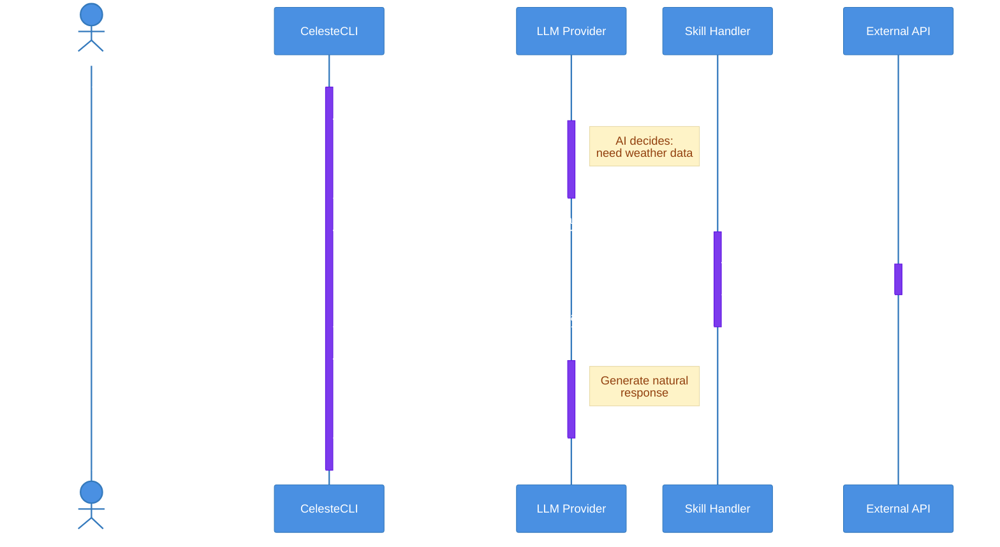
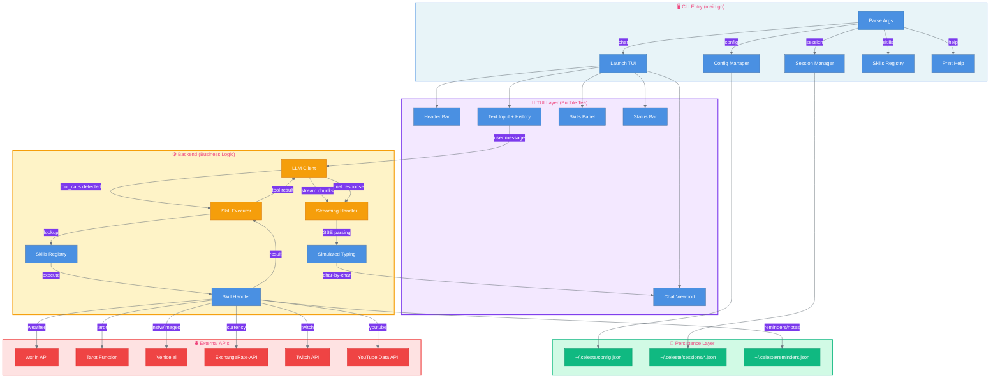

<div align="center">


<sub>Character artwork by [いかわさ (ikawasa23)](https://x.com/ikawasa23)</sub>

# 👁️ Celeste CLI - Interactive AI Assistant

**A premium, corruption-aesthetic command-line interface for CelesteAI**

[](https://golang.org/)
[](LICENSE)
[](https://github.com/charmbracelet/bubbletea)

*Built with [Charm's Bubble Tea](https://github.com/charmbracelet/bubbletea) for flicker-free, modern terminal experiences*

</div>

---

## ✨ What is CelesteCLI?

CelesteCLI is the **official command-line interface** for CelesteAI, featuring:
- 🎨 **Premium TUI** - Flicker-free rendering with corrupted-theme aesthetics
- 🔮 **21 AI-Powered Skills** - Function calling for weather, tarot, conversions, and more
- 💾 **Session Persistence** - Auto-save conversations and resume anytime
- 🌐 **Multi-Provider Support** - Works with OpenAI, Grok/xAI, and more
- 👁️ **Demonic Eye Animation** - Shows when Celeste is thinking
- 🎭 **Celeste Personality** - Embedded AI personality with lore-accurate responses

---

## 🚀 Quick Start

### Quick Install (Recommended)

If you have Go 1.23+ installed:

```bash
go install github.com/whykusanagi/celesteCLI/cmd/celeste@latest
```

The `celeste` binary will be installed to `$GOPATH/bin` (or `~/go/bin` by default).

**Requirements:**
- Go 1.23.0 or higher
- `$GOPATH/bin` (or `~/go/bin`) in your PATH

To add to PATH:
```bash
export PATH="$PATH:$(go env GOPATH)/bin"
```

### Manual Installation

Alternatively, build from source:

```bash
# Clone the repository
git clone https://github.com/whykusanagi/celesteCLI.git
cd celesteCLI

# Build the binary
go build -o celeste ./cmd/celeste

# Install to PATH (optional)
cp celeste ~/.local/bin/
```

### First Run

```bash
# Set up your API key
celeste config --set-key YOUR_OPENAI_API_KEY

# Start chatting!
celeste chat
```

---

## 📚 Table of Contents

- [Installation](#-quick-start)
- [Features](#-features)
- [Skills System (21 Skills)](#-skills-system-21-skills)
- [LLM Provider Compatibility](#-llm-provider-compatibility)
- [Function Calling Flow](#-function-calling-flow-mermaid-diagram)
- [Configuration](#%EF%B8%8F-configuration)
- [Usage](#-usage)
- [Architecture](#%EF%B8%8F-architecture)
- [Development](#-development)
- [Troubleshooting](#-troubleshooting)
- [Contributing](#-contributing)

---

## 🎯 Features

### Interactive TUI Mode
- **Flicker-Free Rendering** - Double-buffered Bubble Tea rendering (no screen tearing)
- **Scrollable Chat** - PgUp/PgDown navigation through conversation history
- **Input History** - Arrow keys to browse previous messages (like bash history)
- **Skills Panel** - Real-time skill execution status with demonic eye animation
- **Corrupted Theme** - Lip Gloss styling with pink/purple abyss aesthetic
- **Simulated Typing** - Smooth streaming effect (configurable speed)

### Skills System (OpenAI Function Calling)
**21 built-in skills** powered by AI function calling:
- Divination (Tarot)
- Content & Media (NSFW, Content Gen, Image Gen)
- Information Services (Weather, Currency, Twitch, YouTube)
- Utilities (Conversions, Encoding, Generators)
- Productivity (Reminders, Notes)

[See complete skills list below](#-skills-system-21-skills)

### Session Management
- **Conversation Persistence** - Auto-save and resume sessions seamlessly
- **Message History** - Full conversation logging with timestamps
- **Session Listing** - Browse and load previous sessions by ID
- **Session Clearing** - Bulk delete sessions when needed

### Multi-Provider Support (8 Providers)
- ✅ **OpenAI** (gpt-4o-mini, gpt-4o) - Full function calling with streaming
- ✅ **Grok/xAI** (grok-4-1-fast) - Optimized for tool calling, 2M context
- ✅ **Venice.ai** (venice-uncensored) - NSFW mode, image generation (no function calling)
- ✅ **Anthropic Claude** (claude-sonnet-4-5) - Advanced tool use features
- ✅ **Google Gemini AI** (gemini-2.0-flash) - **RECOMMENDED** - Simple API keys (AIza...), free tier, full streaming + function calling
- ⚠️ **Google Vertex AI** (gemini-2.0-flash) - **ENTERPRISE** - OAuth2 tokens (ya29...), requires GCP project + billing
- ✅ **OpenRouter** (multi-provider) - Parallel function calling support
- ⚠️ **DigitalOcean** (gpt-4o-mini) - Cloud-only functions (no local skills)
- ❓ **ElevenLabs** - Voice AI (function calling support unknown)

**Dynamic Model Selection** - Auto-selects best tool-calling model per provider
**Capability Indicators** - Visual feedback (✓ skills / ⚠️ no skills) in header

[See full compatibility matrix](#-llm-provider-compatibility)

### Configuration
- **JSON-based Config** - Modern `~/.celeste/config.json` format
- **Named Configs** - Multi-profile support (openai, grok, venice, etc.)
- **Skills Config** - Separate `skills.json` for skill-specific API keys
- **Secrets Handling** - Separate `secrets.json` for backward compatibility
- **Persona Injection** - Configurable Celeste personality prompt
- **Environment Override** - Env vars override file config

---

## 🔮 Skills System (21 Skills)

CelesteCLI uses **OpenAI function calling** to power its skills. You don't invoke skills directly—you chat naturally, and the AI decides when to call them.

### Divination & Entertainment

| Skill | Description | Dependencies |
|-------|-------------|--------------|
| **Tarot Reading** | Three-card or Celtic Cross spreads | Tarot API (requires auth token) |

**Example:**
```
You: Give me a tarot reading
Celeste: *calls tarot_reading skill*
Celeste: Your cards reveal... [interpretation]
```

### Content & Media

| Skill | Description | Dependencies |
|-------|-------------|--------------|
| **NSFW Mode** | Venice.ai uncensored responses | Venice.ai API key |
| **Content Generation** | Platform-specific templates (Twitter/TikTok/YouTube/Discord) | None (LLM-powered) |
| **Image Generation** | Venice.ai image creation | Venice.ai API key |

**Example:**
```
You: Generate a tweet about cybersecurity
Celeste: *calls generate_content skill*
Celeste: Here's your tweet: [280 char tweet with hooks]
```

### Information Services

| Skill | Description | Dependencies |
|-------|-------------|--------------|
| **Weather** | Current conditions and forecasts | wttr.in API (free, no key) |
| **Currency Converter** | Real-time exchange rates | ExchangeRate-API (free) |
| **Twitch Live Check** | Check if streamers are online | Twitch API (client ID required) |
| **YouTube Videos** | Get recent uploads from channels | YouTube Data API (key required) |

**Example:**
```
You: What's the weather in 10001?
Celeste: *calls get_weather skill*
Celeste: It's 45°F and cloudy in New York City...
```

### Utilities (9 Skills)

| Skill | Description | Dependencies |
|-------|-------------|--------------|
| **Unit Converter** | Length, weight, temperature, volume | None (local calculations) |
| **Timezone Converter** | Convert times between zones | None (local calculations) |
| **Hash Generator** | MD5, SHA256, SHA512 | None (crypto/sha256) |
| **Base64 Encode** | Encode text to base64 | None (encoding/base64) |
| **Base64 Decode** | Decode base64 to text | None (encoding/base64) |
| **UUID Generator** | Generate random UUIDs (v4) | None (google/uuid) |
| **Password Generator** | Secure random passwords (customizable) | None (crypto/rand) |
| **QR Code Generator** | Create QR codes from text/URLs | None (skip2/go-qrcode) |

**Example:**
```
You: Convert 100 miles to kilometers
Celeste: *calls convert_units skill*
Celeste: 100 miles is 160.93 kilometers
```

### Productivity (5 Skills)

| Skill | Description | Dependencies |
|-------|-------------|--------------|
| **Set Reminder** | Create reminders with timestamps | Local storage (~/.celeste/reminders.json) |
| **List Reminders** | View all active reminders | Local storage |
| **Save Note** | Store notes by name | Local storage (~/.celeste/notes.json) |
| **Get Note** | Retrieve saved notes | Local storage |
| **List Notes** | View all saved note names | Local storage |

**Example:**
```
You: Remind me to call mom tomorrow at 3pm
Celeste: *calls set_reminder skill*
Celeste: Reminder set for December 4, 2025 at 3:00 PM

You: Save a note called groceries: milk, eggs, bread
Celeste: *calls save_note skill*
Celeste: Note 'groceries' saved successfully!
```

### Skills Configuration

Skill-specific API keys are stored in `~/.celeste/skills.json`:

```json
{
  "venice_api_key": "your-venice-key",
  "tarot_auth_token": "Basic xxx",
  "weather_default_zip_code": "12345",
  "twitch_client_id": "your-client-id",
  "youtube_api_key": "your-youtube-key"
}
```

**Configure via CLI:**
```bash
celeste config --set-venice-key <key>
celeste config --set-weather-zip 12345
celeste config --set-twitch-client-id <id>
celeste config --set-youtube-key <key>
celeste config --set-tarot-token <token>
```

---

## 🌐 LLM Provider Compatibility

CelesteCLI requires **OpenAI-style function calling** for skills to work. Not all LLM providers support this feature.

### Quick Reference Matrix

| Provider | Function Calling | Status | Setup Difficulty |
|----------|------------------|---------|------------------|
| **OpenAI** | ✅ Native | Fully Supported | Easy |
| **Grok (xAI)** | ✅ OpenAI-Compatible | Fully Supported | Easy |
| **DigitalOcean** | ⚠️ Cloud Functions Only | Limited | Advanced (requires cloud deployment) |
| **Venice.ai** | ❓ Unknown | Needs Testing | Unknown |
| **ElevenLabs** | ❓ Unknown | Needs Testing | Unknown |
| **Local (Ollama)** | ⚠️ Depends on Model | Varies | Medium (model-dependent) |

### ✅ Fully Supported: OpenAI

**Setup:**
```bash
celeste config --set-key sk-your-openai-key
celeste config --set-url https://api.openai.com/v1
celeste config --set-model gpt-4o-mini
celeste chat
```

**Why it works:** OpenAI invented function calling and has the most robust implementation.

### ✅ Fully Supported: Grok (xAI)

**Setup:**
```bash
celeste config --set-key your-grok-key
celeste config --set-url https://api.x.ai/v1
celeste config --set-model grok-beta
celeste chat
```

**Why it works:** Grok uses OpenAI-compatible API with full function calling support.

### ⚠️ Limited Support: DigitalOcean

**Limitation:** DigitalOcean AI Agent requires **cloud-hosted functions**. Skills cannot execute locally.

**Why skills won't work:**
- CelesteCLI executes skills locally (unit converter, QR generator, etc.)
- DigitalOcean expects HTTP endpoints in the cloud
- No way to bridge local execution with DigitalOcean's architecture

**Workarounds:**
1. Use OpenAI or Grok instead
2. Deploy skills as cloud functions (advanced)
3. Use CelesteCLI without skills (chat only)

### Testing Provider Compatibility

Run automated tests to verify function calling:

```bash
# Test OpenAI
OPENAI_API_KEY=your-key go test ./cmd/celeste/llm -run TestOpenAI_FunctionCalling -v

# Test Grok
GROK_API_KEY=your-key go test ./cmd/celeste/llm -run TestGrok_FunctionCalling -v

# Test Venice.ai
VENICE_API_KEY=your-key go test ./cmd/celeste/llm -run TestVeniceAI_FunctionCalling -v
```

**Expected output (working):**
```
=== RUN   TestOpenAI_FunctionCalling
✅ OpenAI function calling works! Called get_weather with location=new york
--- PASS: TestOpenAI_FunctionCalling (2.34s)
```

**Expected output (not working):**
```
=== RUN   TestVeniceAI_FunctionCalling
⚠️ Venice.ai function calling failed: tools not supported
--- SKIP: TestVeniceAI_FunctionCalling
```

📚 **See [docs/LLM_PROVIDERS.md](docs/LLM_PROVIDERS.md) for complete provider compatibility guide**

---

## 🎨 Function Calling Flow (Mermaid Diagram)

Here's how skills work under the hood:



### Key Points:
1. **Tools sent with every request** - All available skills are listed in the API call
2. **LLM decides when to call** - You don't manually invoke skills, the AI does
3. **Local execution** - Skills run on your machine (unless they need external APIs)
4. **Result sent back to LLM** - Tool results are formatted and returned for interpretation
5. **Natural language output** - LLM converts structured data into conversational responses

**This requires OpenAI-style function calling support!** Providers without this feature will ignore tools and respond as if they don't have access to data.

---

## ⚙️ Configuration

### Configuration Files

CelesteCLI uses three config files in `~/.celeste/`:

| File | Purpose | Example |
|------|---------|---------|
| **config.json** | Main configuration | API endpoint, model, timeouts |
| **secrets.json** | API keys (backward compat) | OpenAI API key only |
| **skills.json** | Skill-specific configs | Venice.ai key, weather zip code |

### Main Config (`~/.celeste/config.json`)

```json
{
  "api_key": "",
  "base_url": "https://api.openai.com/v1",
  "model": "gpt-4o-mini",
  "timeout": 60,
  "skip_persona_prompt": false,
  "simulate_typing": true,
  "typing_speed": 40
}
```

### Skills Config (`~/.celeste/skills.json`)

```json
{
  "venice_api_key": "your-venice-key",
  "venice_base_url": "https://api.venice.ai/api/v1",
  "venice_model": "venice-uncensored",
  "tarot_function_url": "https://your-tarot-api",
  "tarot_auth_token": "Basic xxx",
  "weather_default_zip_code": "10001",
  "twitch_client_id": "your-twitch-client-id",
  "twitch_default_streamer": "whykusanagi",
  "youtube_api_key": "your-youtube-key",
  "youtube_default_channel": "UC..."
}
```

### Environment Variables (Override Config)

```bash
export CELESTE_API_KEY="sk-your-key"
export CELESTE_API_ENDPOINT="https://api.openai.com/v1"
export VENICE_API_KEY="your-venice-key"
export TAROT_AUTH_TOKEN="Basic xxx"
```

Environment variables take precedence over config files.

### Config Commands

```bash
# View current config
celeste config --show

# Main config settings
celeste config --set-key sk-xxx
celeste config --set-url https://api.openai.com/v1
celeste config --set-model gpt-4o-mini
celeste config --skip-persona true
celeste config --simulate-typing true
celeste config --typing-speed 60

# Named configs (multi-profile support)
celeste config --list                     # List all profiles
celeste config --init openai              # Create openai profile
celeste config --init grok                # Create grok profile
celeste -config grok chat                 # Use grok profile

# Skill configuration
celeste config --set-venice-key <key>
celeste config --set-weather-zip 10001
celeste config --set-twitch-client-id <id>
celeste config --set-youtube-key <key>
celeste config --set-tarot-token <token>
```

### Named Configs (Multi-Profile)

Create separate configs for different providers:

```bash
# Create OpenAI config
celeste config --init openai
celeste config --set-key sk-openai-key
celeste config --set-model gpt-4o-mini

# Create Grok config
celeste config --init grok
celeste config --set-key xai-grok-key
celeste config --set-url https://api.x.ai/v1
celeste config --set-model grok-beta

# Use specific config
celeste -config grok chat
```

**Available templates**: `openai`, `grok`, `elevenlabs`, `venice`, `digitalocean`

---

## 🎯 Usage

### Interactive TUI Mode

```bash
# Launch interactive TUI (default command)
celeste chat

# Use a specific named config
celeste -config grok chat
```

### Keyboard Shortcuts

| Key | Action |
|-----|--------|
| `Ctrl+C` | Exit immediately |
| `Ctrl+D` | Exit gracefully |
| `PgUp/PgDown` | Scroll chat history (full page) |
| `Shift+↑/↓` | Scroll chat (3 lines at a time) |
| `↑/↓` | Navigate input history (previous messages) |
| `Enter` | Send message |
| `Esc` | Clear current input |

### In-Chat Commands

#### Core Commands
| Command | Action |
|---------|--------|
| `/help` | Show available commands and keyboard shortcuts |
| `/clear` | Clear chat history (current session only) |
| `/exit`, `/quit`, `/q` | Exit application |

#### Provider & Model Management
| Command | Action |
|---------|--------|
| `/endpoint <provider>` | Switch to a different LLM provider (openai, grok, venice, gemini, openrouter, etc.) |
| `/set-model` | List available models for current provider with capability indicators |
| `/set-model <name>` | Switch to a specific model (validates function calling support) |
| `/set-model <name> --force` | Override model compatibility warnings |
| `/list-models` | Alias for `/set-model` |

**Examples:**
```bash
# Switch to Grok (auto-selects grok-4-1-fast for tool calling)
/endpoint grok

# List Grok models with capability indicators
/set-model
# Output:
# ✓ grok-4-1-fast - Best for tool calling (2000k context)
# ✓ grok-4-1 - High-quality reasoning
#   grok-4-latest - Latest general model (no skills)

# Force use a non-tool model
/set-model grok-4-latest --force

# Switch to Gemini AI (AI Studio)
/endpoint gemini
```

### Single Message Mode (Non-Interactive)

```bash
# Send a single message and exit
celeste message "What is the meaning of life?"

# Or use shorthand
celeste "Hello, Celeste!"
```

### Session Management

```bash
# List saved sessions
celeste session --list

# Load a specific session
celeste session --load abc123def

# Clear all sessions
celeste session --clear
```

Sessions are auto-saved to `~/.celeste/sessions/` and can be resumed later.

### Skills Management

```bash
# List available skills (with descriptions)
celeste skills --list

# Initialize default skill configuration files
celeste skills --init
```

### Version & Help

```bash
# Show version
celeste version
celeste --version

# Show help
celeste help
celeste --help
```

### 🔥 NSFW Mode (Venice.ai Integration)

NSFW mode provides uncensored chat and NSFW image generation via Venice.ai:

**Activating NSFW Mode:**
```bash
# In chat, type:
/nsfw

# Header will show: 🔥 NSFW • img:lustify-sdxl
```

**Image Generation Commands:**

```bash
# Generate with default model (lustify-sdxl)
image: cyberpunk cityscape at night

# Generate anime-style images
anime: magical girl with sword

# Generate dream-like images
dream: surreal cosmic landscape

# Use specific model for one generation
image[venice-sd35]: photorealistic portrait

# Upscale existing image
upscale: ~/path/to/image.jpg
```

**Model Management:**

```bash
# Set default image model
/set-model wai-Illustrious

# View available models
/set-model

# Models available:
# - lustify-sdxl (default NSFW)
# - wai-Illustrious (anime style)
# - hidream (dream-like quality)
# - nano-banana-pro
# - venice-sd35 (Stable Diffusion 3.5)
# - lustify-v7
# - qwen-image
```

**Image Quality Settings:**

All images generate with high-quality defaults:
- **Steps**: 40 (1-50, higher = more detail)
- **CFG Scale**: 12.0 (0-20, higher = stronger prompt adherence)
- **Size**: 1024x1024 (up to 1280x1280)
- **Format**: PNG (lossless)
- **Safe Mode**: Disabled (no NSFW blurring)

**Download Location:**

Images save to `~/Downloads` by default. Customize in `~/.celeste/skills.json`:

```json
{
  "downloads_dir": "~/Pictures"
}
```

**LLM Prompt Chaining:**

Ask the uncensored LLM to write prompts for you:

```
You: Write a detailed NSFW anime scene description
Celeste: [Generates detailed prompt]
You: image: [paste Celeste's prompt]
Celeste: *generates image from AI-written prompt*
```

**Returning to Safe Mode:**

```bash
/safe
# Returns to OpenAI endpoint with skills enabled
```

**Configuration:**

Add Venice.ai API key to `~/.celeste/skills.json`:

```json
{
  "venice_api_key": "your-venice-api-key",
  "venice_base_url": "https://api.venice.ai/api/v1",
  "venice_model": "venice-uncensored",
  "venice_image_model": "lustify-sdxl",
  "downloads_dir": "~/Downloads"
}
```

**Limitations:**

- Function calling disabled in NSFW mode (Venice uncensored doesn't support it)
- Skills are unavailable (use /safe to re-enable)
- Video generation not available (Venice API limitation)

---

## 🏗️ Architecture

### Project Structure

```
celesteCLI/
├── cmd/celeste/               # Main application
│   ├── main.go               # CLI entry point
│   ├── tui/                  # Bubble Tea TUI components
│   │   ├── app.go           # Main TUI model & update loop
│   │   ├── chat.go          # Scrollable viewport (messages)
│   │   ├── input.go         # Text input + history
│   │   ├── skills.go        # Skills panel (execution status)
│   │   ├── styles.go        # Lip Gloss theme (corrupted aesthetic)
│   │   ├── streaming.go     # Simulated typing animation
│   │   └── messages.go      # Bubble Tea messages (events)
│   ├── skills/              # Skills system
│   │   ├── registry.go      # Skill registry (register/lookup)
│   │   ├── executor.go      # Skill execution engine
│   │   └── builtin.go       # 21 built-in skills
│   ├── llm/                 # LLM client
│   │   ├── client.go        # OpenAI-compatible client
│   │   ├── stream.go        # Streaming handler (SSE)
│   │   └── providers_test.go # Provider compatibility tests
│   ├── config/              # Configuration management
│   │   ├── config.go        # JSON config (load/save/named)
│   │   └── session.go       # Session persistence
│   └── prompts/             # Persona prompts
│       ├── celeste.go       # Prompt loader
│       └── celeste_essence.json # Embedded Celeste personality
├── docs/                     # Documentation
│   ├── LLM_PROVIDERS.md     # Provider compatibility guide
│   ├── CAPABILITIES.md      # What Celeste can do (ecosystem)
│   ├── PERSONALITY.md       # Celeste personality quick ref
│   └── ROUTING.md           # Sub-agent routing (ecosystem)
├── LICENSE                   # MIT License
├── CHANGELOG.md             # Version history
├── CONTRIBUTING.md          # Contribution guidelines
├── SECURITY.md              # Security policy
└── README.md                # This file
```

### Component Flow Diagram



### Data Flow: User Message → Response

1. **User Input** → Text input component (with history)
2. **TUI Update** → Bubble Tea update loop processes input
3. **LLM Request** → Client sends message + tools to OpenAI/Grok
4. **Stream Parse** → Parse SSE chunks (text or tool_calls)
5. **Tool Execution** (if tool_calls):
   - Executor receives tool call JSON
   - Registry looks up skill handler
   - Handler executes (local or API call)
   - Result sent back to LLM
6. **Response Stream** → LLM generates natural language response
7. **Simulated Typing** → Character-by-character rendering (if enabled)
8. **Viewport Update** → Chat history updates with new message
9. **Session Save** → Auto-save conversation to disk

---

## 🎨 Theming

The TUI uses the **corrupted-theme** color palette inspired by Celeste's abyss aesthetic:

| Color | Hex | RGB | Usage |
|-------|-----|-----|-------|
| **Accent** | `#d94f90` | `rgb(217, 79, 144)` | Headers, prompts, highlights, user messages |
| **Purple** | `#8b5cf6` | `rgb(139, 92, 246)` | Function calls, secondary elements, skill names |
| **Dark Purple** | `#6d28d9` | `rgb(109, 40, 217)` | Borders, subtle accents |
| **Background** | `#0a0a0a` | `rgb(10, 10, 10)` | Main background (terminal) |
| **Surface** | `#1a1a1a` | `rgb(26, 26, 26)` | Elevated surfaces, panels |
| **Text** | `#f5f1f8` | `rgb(245, 241, 248)` | Primary text, assistant messages |
| **Muted** | `#7a7085` | `rgb(122, 112, 133)` | Hints, timestamps, secondary text |
| **Success** | `#10b981` | `rgb(16, 185, 129)` | Skill success indicators |
| **Error** | `#ef4444` | `rgb(239, 68, 68)` | Errors, warnings |

### Demonic Eye Animation

When Celeste is thinking, a demonic eye animation plays:

```
👁️  → 👀 → ◉◉ → ●● (pulsing)
```

Colors pulse between magenta (`#d94f90`) and red (`#dc2626`) to show "corruption deepening."

---

## 🔧 Development

### Prerequisites

- **Go 1.21+** (uses go 1.24.0 for latest features)
- **Terminal** with 256-color support (iTerm2, Alacritty, Windows Terminal, etc.)
- **API Keys** (for testing skills):
  - OpenAI API key (required for chat)
  - Venice.ai API key (optional, for NSFW/image skills)
  - YouTube Data API key (optional, for YouTube skill)
  - Twitch Client ID (optional, for Twitch skill)

### Building from Source

```bash
cd celesteCLI
go mod tidy
go build -o celeste ./cmd/celeste
```

### Running Tests

```bash
# Run all tests
go test ./...

# Run with coverage
go test -cover ./...

# Run specific package
go test ./cmd/celeste/skills -v

# Run provider compatibility tests
OPENAI_API_KEY=sk-xxx go test ./cmd/Celeste/llm -run TestOpenAI_FunctionCalling -v
```

### Code Quality Checks

```bash
# Format code
gofmt -w ./cmd

# Run linter
go vet ./...

# Check for unused imports
goimports -w ./cmd
```

### Dependencies

| Package | Purpose | Version |
|---------|---------|---------|
| `github.com/charmbracelet/bubbletea` | TUI framework | v1.3.10 |
| `github.com/charmbracelet/bubbles` | TUI components (viewport, textinput) | v0.21.0 |
| `github.com/charmbracelet/lipgloss` | Styling engine | v1.1.0 |
| `github.com/sashabaranov/go-openai` | OpenAI client (streaming, function calling) | v1.20.4 |
| `github.com/google/uuid` | UUID generation | v1.6.0 |
| `github.com/skip2/go-qrcode` | QR code generation | v0.0.0-20200617195104 |
| `github.com/stretchr/testify` | Testing framework | v1.11.1 |

### Branch Strategy

- **main** - Stable releases only
- **feature/bubbletea-tui** - Current development branch (TUI implementation)
- Feature branches - Fork from `feature/bubbletea-tui`

---

## 🔍 Troubleshooting

### No API Key Configured

**Error:**
```
No API key configured.
Set CELESTE_API_KEY environment variable or run: celeste config --set-key <key>
```

**Solution:**
```bash
celeste config --set-key sk-your-openai-key
```

Or use environment variable:
```bash
export CELESTE_API_KEY="sk-your-key"
celeste chat
```

### Skills Not Working

**Symptom:** LLM says "I don't have access to real-time data" when asking for weather, etc.

**Possible Causes:**
1. **Provider doesn't support function calling** - See [LLM Provider Compatibility](#-llm-provider-compatibility)
2. **Skill config missing** - Check `~/.celeste/skills.json` for required API keys

**Solution:**
```bash
# Test provider compatibility
OPENAI_API_KEY=your-key go test ./cmd/celeste/llm -run TestOpenAI_FunctionCalling -v

# If provider doesn't support skills, switch to OpenAI or Grok
celeste config --set-url https://api.openai.com/v1
celeste config --set-key sk-openai-key
```

### Persona Prompt Issues

**Symptom:** Celeste doesn't respond with personality, or endpoint errors

**Cause:** Your endpoint might already have the Celeste persona embedded (e.g., DigitalOcean agent)

**Solution:**
```bash
celeste config --skip-persona true
```

### Streaming Looks Choppy

**Symptom:** Text appears in large chunks instead of smooth typing

**Solution:** Enable simulated typing:
```bash
celeste config --simulate-typing true
celeste config --typing-speed 40  # Adjust speed (chars per second)
```

### Session Not Saving

**Symptom:** Conversations don't persist between runs

**Cause:** Sessions directory not writable or doesn't exist

**Solution:**
```bash
# Check permissions
ls -la ~/.celeste/sessions/

# If missing, create it
mkdir -p ~/.celeste/sessions/
chmod 755 ~/.celeste/sessions/
```

### TUI Rendering Issues

**Symptom:** Screen flickering, garbled text, or broken layout

**Possible Causes:**
1. Terminal doesn't support 256 colors
2. Terminal size too small
3. Environment variable issues

**Solution:**
```bash
# Check terminal capabilities
echo $TERM        # Should be xterm-256color or similar
tput colors       # Should return 256

# Set TERM if needed
export TERM=xterm-256color

# Ensure minimum terminal size (80x24)
resize  # Check current size
```

### Build Errors

**Error:** `go: updates to go.mod needed; to update it: go mod tidy`

**Solution:**
```bash
go mod tidy
go build -o celeste ./cmd/celeste
```

**Error:** `package X is not in GOROOT`

**Solution:**
```bash
# Update dependencies
go get -u ./...
go mod tidy
```

---

## 🤝 Contributing

We welcome contributions! Please see [CONTRIBUTING.md](CONTRIBUTING.md) for detailed guidelines.

### Quick Start for Contributors

1. **Fork the repository**
2. **Create a feature branch** from `feature/bubbletea-tui`:
   ```bash
   git checkout feature/bubbletea-tui
   git checkout -b feature/your-feature-name
   ```
3. **Make your changes**
4. **Test thoroughly**:
   ```bash
   go test ./...
   go vet ./...
   gofmt -l ./cmd  # Should return nothing
   ```
5. **Submit a pull request** to `feature/bubbletea-tui`

### Areas for Contribution

- 🧪 **Testing** - Provider compatibility tests, skill unit tests, integration tests
- 📚 **Documentation** - Improve guides, add examples, translate to other languages
- 🎨 **Themes** - Alternative color schemes, terminal themes
- 🔮 **Skills** - New skill implementations (requires function calling support)
- 🐛 **Bug Fixes** - See [GitHub Issues](https://github.com/whykusanagi/celesteCLI/issues)
- ⚡ **Performance** - Optimize streaming, reduce memory usage

### Testing Your Changes

Before submitting a PR:

```bash
# Build succeeds
go build -o celeste ./cmd/celeste

# All tests pass
go test ./...

# No vet warnings
go vet ./...

# Code is formatted
gofmt -w ./cmd
git diff  # Should show no changes

# TUI works
./celeste chat
```

---

## 📄 License

This project is licensed under the **MIT License** - see the [LICENSE](LICENSE) file for details.

---

## 🔗 Related Projects

CelesteCLI is part of the larger **CelesteAI Ecosystem**:

| Project | Description | Link |
|---------|-------------|------|
| **CelesteCLI** | Command-line interface (this project) | [GitHub](https://github.com/whykusanagi/celesteCLI) |
| **Union Raid** | NIKKE game companion web app | [raid.whykusanagi.xyz](https://raid.whykusanagi.xyz) |
| **Web Widget** | Chat widget for whykusanagi.xyz | Integrated |
| **Twitch Bot** | Live chat moderation & interaction | Integrated |
| **Discord Bot** | Custom commands & personality | Private |
| **Flipper Zero App** | Celeste animations & personality | Private |

See [docs/CAPABILITIES.md](docs/CAPABILITIES.md) for complete ecosystem documentation.

---

## 🙏 Acknowledgments

- **[Charm](https://charm.sh/)** - Bubble Tea, Bubbles, and Lip Gloss TUI frameworks
- **[sashabaranov/go-openai](https://github.com/sashabaranov/go-openai)** - OpenAI Go client
- **OpenAI** - Function calling API
- **xAI** - Grok API
- **Venice.ai** - Uncensored AI models
- **wttr.in** - Free weather API

---

## 📞 Support

- **Issues:** [GitHub Issues](https://github.com/whykusanagi/celesteCLI/issues)
- **Security:** See [SECURITY.md](SECURITY.md)
- **Documentation:** [docs/](docs/)
- **Community:** [Discord](https://discord.gg/whykusanagi) (coming soon)

---

<div align="center">

**Built with 💜 by [@whykusanagi](https://github.com/whykusanagi)**

*"The Abyss whispers through the terminal..." - Celeste*

</div>
