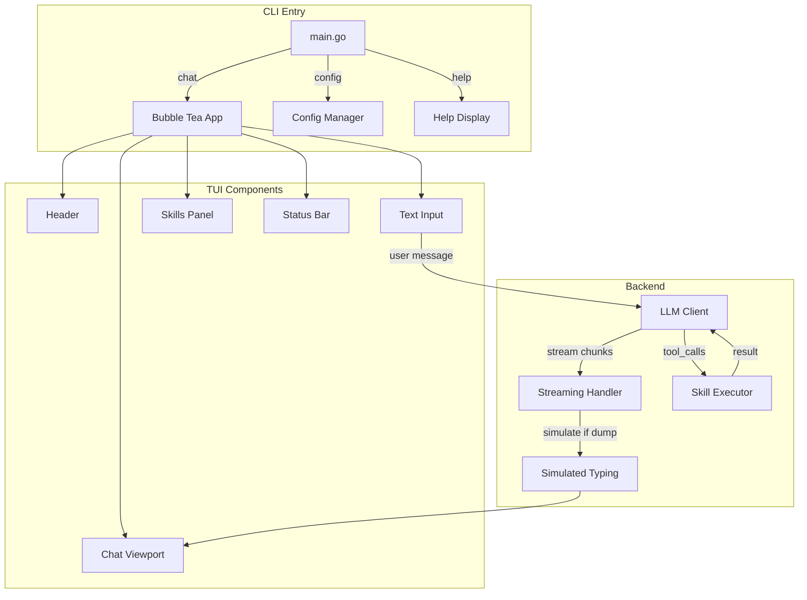

# Celeste CLI - Interactive AI Assistant

A premium, corruption-aesthetic command-line interface for CelesteAI, built with [Charm's Bubble Tea](https://github.com/charmbracelet/bubbletea) for a flicker-free, modern TUI experience. Features real-time streaming, function calling (skills), and session persistence.

## 🚀 Features

### Interactive TUI Mode
- **Flicker-Free Rendering** - Double-buffered Bubble Tea rendering
- **Scrollable Chat** - PgUp/PgDown navigation through conversation history
- **Input History** - Arrow keys to browse previous messages
- **Skills Panel** - Real-time skill execution status
- **Corrupted Theme** - Lip Gloss styling with pink/purple abyss aesthetic

### Skills System (OpenAI Function Calling)
- **Tarot Reading** - Three-card or Celtic Cross spreads
- **NSFW Mode** - Venice.ai integration for uncensored content
- **Content Generation** - Platform-specific content (Twitter, TikTok, YouTube, Discord)
- **Image Generation** - Venice.ai image generation

### Session Management
- **Conversation Persistence** - Auto-save and resume sessions
- **Message History** - Full conversation logging with timestamps
- **Session Listing** - Browse and load previous sessions

### Configuration
- **JSON-based Config** - Modern `~/.celeste/config.json` format
- **Automatic Migration** - Migrates from old `.celesteAI` format
- **Secrets Handling** - Separate `secrets.json` for sensitive data
- **Persona Injection** - Configurable Celeste personality prompt

## 📦 Installation

### Prerequisites
- Go 1.21+
- Terminal with 256-color support (iTerm2, Alacritty, etc.)

### Quick Install
```bash
git clone https://github.com/whykusanagi/celesteCLI.git
cd celesteCLI
git checkout feature/bubbletea-tui
go build -o Celeste ./cmd/Celeste
cp Celeste ~/.local/bin/
```

### Verify Installation
```bash
Celeste version
Celeste help
```

## ⚙️ Configuration

### New JSON Config (`~/.celeste/config.json`)
```json
{
  "api_key": "",
  "base_url": "https://api.openai.com/v1",
  "model": "gpt-4o-mini",
  "timeout": 60,
  "skip_persona_prompt": false,
  "simulate_typing": true,
  "typing_speed": 40
}
```

### Secrets (`~/.celeste/secrets.json`)
```json
{
  "api_key": "sk-xxx",
  "venice_api_key": "your-venice-key",
  "tarot_auth_token": "Basic xxx"
}
```

### Environment Variables
- `CELESTE_API_KEY` - API key (overrides config)
- `CELESTE_API_ENDPOINT` - API endpoint (overrides config)
- `VENICE_API_KEY` - Venice.ai API key for NSFW mode
- `TAROT_AUTH_TOKEN` - Tarot function auth token

### Config Commands
```bash
# View current config
Celeste config --show

# Set API key
Celeste config --set-key sk-xxx

# Set API URL (for DigitalOcean or custom endpoints)
Celeste config --set-url https://your-endpoint/v1

# Skip persona prompt (if endpoint already has it)
Celeste config --skip-persona true

# Enable/disable simulated typing
Celeste config --simulate-typing true
Celeste config --typing-speed 60
```

## 🎯 Usage

### Interactive TUI Mode
```bash
# Launch interactive TUI
Celeste chat
```

### Keyboard Shortcuts
| Key | Action |
|-----|--------|
| `Ctrl+C` | Exit immediately |
| `PgUp/PgDown` | Scroll chat history |
| `Shift+↑/↓` | Scroll chat (3 lines) |
| `↑/↓` | Navigate input history |
| `Enter` | Send message |

### In-Chat Commands
| Command | Action |
|---------|--------|
| `help` | Show available commands |
| `clear` | Clear chat history |
| `exit`, `quit`, `q` | Exit application |

### Single Message Mode
```bash
# Send a single message and exit
Celeste message "What is the meaning of life?"

# Or just type after the command
Celeste "Hello, Celeste!"
```

### Skills Management
```bash
# List available skills
Celeste skills --list

# Initialize default skill files
Celeste skills --init
```

### Session Management
```bash
# List saved sessions
Celeste session --list

# Load a specific session
Celeste session --load <id>

# Clear all sessions
Celeste session --clear
```

## 🏗️ Architecture

```
celesteCLI/
├── cmd/Celeste/
│   ├── main.go              # CLI entry point
│   ├── tui/                  # Bubble Tea TUI
│   │   ├── app.go           # Main TUI model
│   │   ├── chat.go          # Scrollable viewport
│   │   ├── input.go         # Text input + history
│   │   ├── skills.go        # Skills panel
│   │   ├── styles.go        # Lip Gloss theme
│   │   ├── streaming.go     # Simulated typing
│   │   └── messages.go      # Bubble Tea messages
│   ├── skills/              # Skills system
│   │   ├── registry.go      # Skill registry
│   │   ├── executor.go      # Skill execution
│   │   └── builtin.go       # Built-in skills
│   ├── llm/                 # LLM client
│   │   ├── client.go        # OpenAI-compatible
│   │   └── stream.go        # Streaming handler
│   ├── config/              # Configuration
│   │   ├── config.go        # JSON config
│   │   └── session.go       # Session persistence
│   └── prompts/             # Persona prompts
│       ├── celeste.go       # Prompt loader
│       └── celeste_essence.json  # Embedded persona
```

### Component Flow



## 🎨 Theming

The TUI uses the corrupted-theme color palette:

| Color | Hex | Usage |
|-------|-----|-------|
| Accent | `#d94f90` | Headers, prompts, highlights |
| Purple | `#8b5cf6` | Function calls, secondary |
| Background | `#0a0a0a` | Main background |
| Text | `#f5f1f8` | Primary text |
| Muted | `#7a7085` | Hints, timestamps |

## 🔧 Development

### Building
```bash
cd celesteCLI
go mod tidy
go build -o Celeste ./cmd/Celeste
```

### Dependencies
- `github.com/charmbracelet/bubbletea` - TUI framework
- `github.com/charmbracelet/bubbles` - TUI components
- `github.com/charmbracelet/lipgloss` - Styling
- `github.com/sashabaranov/go-openai` - OpenAI client
- `github.com/aws/aws-sdk-go` - S3 integration

### Branch
Development is on the `feature/bubbletea-tui` branch.

## 🔍 Troubleshooting

### No API Key
```
No API key configured.
Set CELESTE_API_KEY environment variable or run: celeste config --set-key <key>
```
**Solution**: Set your API key with `Celeste config --set-key sk-xxx`

### Persona Prompt Not Working
If your endpoint already has the Celeste persona embedded:
```bash
Celeste config --skip-persona true
```

### Streaming Looks Choppy
Enable simulated typing for smoother appearance:
```bash
Celeste config --simulate-typing true
Celeste config --typing-speed 40
```

### Session Not Saving
Sessions are saved to `~/.celeste/sessions/`. Ensure the directory is writable.

## 📝 License

Part of the CelesteAI ecosystem. See LICENSE for details.

## 🤝 Contributing

1. Fork the repository
2. Create a feature branch from `feature/bubbletea-tui`
3. Make your changes
4. Test the TUI thoroughly
5. Submit a pull request
