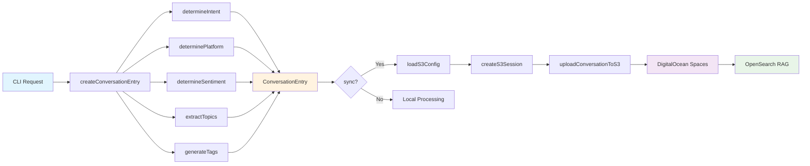
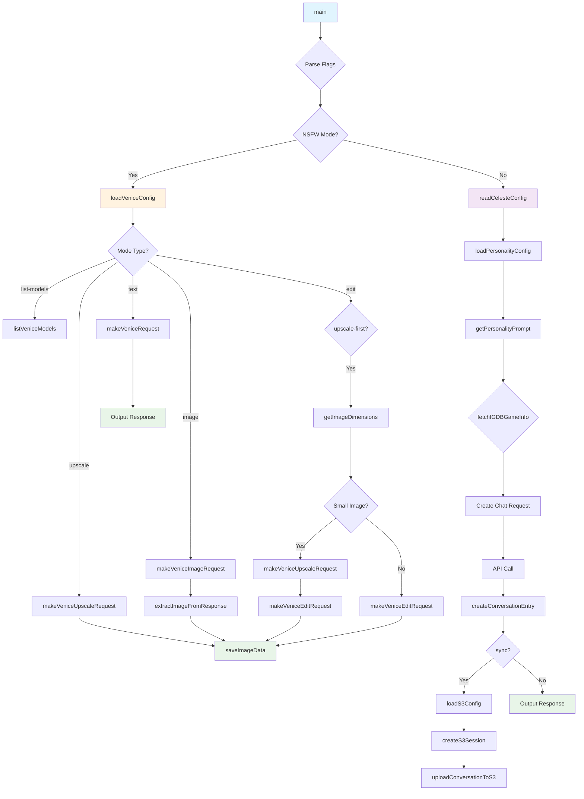
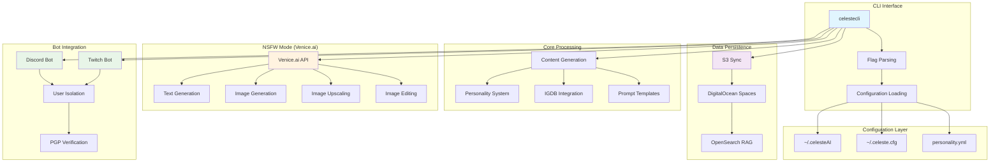

# Celeste CLI

A powerful command-line interface for interacting with CelesteAI, featuring content generation, image processing, and NSFW capabilities through Venice.ai integration.

## 🚀 Features

### Core Functionality
- **Content Generation**: Twitter posts, TikTok captions, YouTube descriptions, Discord announcements
- **Personality System**: YAML-based personality configuration with multiple personas
- **Game Integration**: IGDB API integration for game metadata
- **S3 Sync**: DigitalOcean Spaces integration for conversation storage
- **Bot Integration**: Discord/Twitch bot support with user isolation

### NSFW Mode (Venice.ai Integration)
- **Text Generation**: Uncensored content using `venice-uncensored` model
- **Image Generation**: NSFW image creation with `lustify-sdxl` model
- **Image Upscaling**: High-quality upscaling with fidelity controls
- **Image Editing**: Inpainting and signature removal
- **Smart Workflows**: Optimized 2-step process for small images

## 📦 Installation

### Prerequisites
- Go 1.19+
- Venice.ai API key (for NSFW features)
- DigitalOcean Spaces credentials (for S3 sync)

### Quick Install
```bash
git clone <repository>
cd celesteCLI
go build -o celestecli main.go scaffolding.go
./install.sh
```

### Manual Install
```bash
go build -o celestecli main.go scaffolding.go
cp celestecli ~/.local/bin/
chmod +x ~/.local/bin/celestecli
```

## ⚙️ Configuration

### CelesteAI Configuration (`~/.celesteAI`)
```bash
# CelesteAI API
endpoint=https://your-celeste-api-endpoint
api_key=your-api-key

# IGDB Integration
client_id=your-igdb-client-id
secret=your-igdb-client-secret

# NSFW Mode (Venice.ai)
venice_api_key=your-venice-api-key
venice_base_url=https://api.venice.ai/api/v1
venice_model=venice-uncensored
venice_upscaler=upscaler
```

### S3 Configuration (`~/.celeste.cfg`)
```bash
# DigitalOcean Spaces
endpoint=https://sfo3.digitaloceanspaces.com
bucket_name=whykusanagi
access_key_id=your-access-key
secret_access_key=your-secret-key
```

## 🎯 Usage

### Basic Content Generation
```bash
# Twitter post
celestecli --type tweet --game "NIKKE" --tone "lewd"

# TikTok caption
celestecli --type tiktok --tone "playful"

# YouTube description
celestecli --type ytdesc --game "Streaming" --tone "professional"
```

### NSFW Mode
```bash
# Uncensored text generation
celestecli --nsfw --context "Generate explicit content"

# Image generation
celestecli --nsfw --image --context "Generate NSFW image of Celeste"

# Image upscaling
celestecli --nsfw --upscale --image-path "image.png"

# Image editing (signature removal)
celestecli --nsfw --edit --image-path "image.png" --edit-prompt "remove signature"

# Optimized workflow for small images
celestecli --nsfw --edit --image-path "small_image.png" --edit-prompt "remove watermark" --upscale-first
```

### Advanced Options
```bash
# List available Venice.ai models
celestecli --nsfw --list-models

# Override model
celestecli --nsfw --model "wai-Illustrious" --image --context "Anime style"

# Custom output filename
celestecli --nsfw --image --output "my_image.png" --context "Custom filename"

# Preserve original size
celestecli --nsfw --edit --image-path "large_image.png" --edit-prompt "edit" --preserve-size
```

## 🎨 Image Processing Workflows

### Image Processing Pipeline

```mermaid
graph TD
    A[Image Input] --> B{Image Size?}
    
    B -->|< 1024x1024| C[Small Image Workflow]
    B -->|≥ 1024x1024| D[Large Image Workflow]
    
    C --> E[getImageDimensions]
    E --> F[makeVeniceUpscaleRequest]
    F --> G[makeVeniceEditRequest]
    G --> H[saveImageData]
    
    D --> I{upscale-first?}
    I -->|Yes| J[makeVeniceUpscaleRequest]
    I -->|No| K[makeVeniceEditRequest]
    J --> K
    K --> L{preserve-size?}
    L -->|Yes| M[makeVeniceUpscaleRequest]
    L -->|No| N[saveImageData]
    M --> N
    
    H --> O[Final Output]
    N --> O
    
    style A fill:#e1f5fe
    style C fill:#fff3e0
    style D fill:#f3e5f5
    style O fill:#e8f5e8
```



### Standard Upscaling
- **Input**: Any image ≥256x256 pixels
- **Output**: 2x upscaled with quality preservation
- **Parameters**: Conservative settings for fidelity

### Smart Editing Workflow
- **Small Images** (<1024x1024): Uses `--upscale-first` (2 API calls)
  1. Upscale to 1024x1024
  2. Edit at native size
- **Large Images** (≥1024x1024): Uses standard edit workflow
- **Result**: High-quality edited images without distortion

### Quality Controls
- **Enhancement Creativity**: 0.0-1.0 (lower = more faithful)
- **Replication Level**: 0.0-1.0 (higher = more faithful)
- **Enhancement Prompt**: Custom instructions for upscaling

## 🤖 Bot Integration

### Environment Variables
```bash
export CELESTE_USER_ID="user123"
export CELESTE_PLATFORM="discord"
export CELESTE_CHANNEL_ID="channel123"
export CELESTE_GUILD_ID="guild123"
export CELESTE_OVERRIDE_ENABLED="true"
export CELESTE_PGP_SIGNATURE="signature"
```

### User Isolation
- Each user gets separate conversation contexts
- Platform-specific metadata tracking
- PGP signature verification for override commands

## 📊 S3 Integration & RAG

### Data Flow Architecture



### Conversation Storage
- **Format**: Structured JSON with intent, purpose, topics
- **Location**: `s3://whykusanagi/celeste/conversations/`
- **Metadata**: User ID, platform, sentiment, success tracking

### OpenSearch Integration
- **Purpose**: RAG (Retrieval-Augmented Generation)
- **Data Structure**: Intent-based organization
- **Benefits**: Contextual responses based on conversation history

## 🔧 Development

### Function Call Flow



### Technical Architecture



### Project Structure
```
celesteCLI/
├── main.go              # Core CLI application
├── scaffolding.go       # Prompt template loader
├── scaffolding.json     # Prompt templates
├── personality.yml      # Celeste personality configuration
├── go.mod              # Go dependencies
├── install.sh          # Installation script
└── README.md           # This file
```

### Dependencies
- `github.com/aws/aws-sdk-go` - S3 integration
- `github.com/sashabaranov/go-openai` - Venice.ai integration
- `gopkg.in/yaml.v3` - YAML configuration parsing

### Building
```bash
go mod tidy
go build -o celestecli main.go scaffolding.go
```

## 🎭 Personality System

### Configuration (`personality.yml`)
- **Personas**: Multiple character modes (stream, moderation, etc.)
- **Content Types**: Specialized templates for different platforms
- **Voice Rules**: Tone and style guidelines
- **Safety Modes**: Content filtering and guardrails

### Available Personas
- `celeste_stream` - Default streaming persona
- `celeste_ad_read` - Advertisement reading
- `celeste_moderation_warning` - Discord moderation

## 🚨 NSFW Mode Details

### Venice.ai Models
- **Text**: `venice-uncensored` - Uncensored text generation
- **Images**: `lustify-sdxl` - NSFW image generation
- **Anime**: `wai-Illustrious` - Anime-style generation
- **Upscaling**: `upscaler` - High-quality upscaling

### API Endpoints
- `/image/generate` - Image generation
- `/image/upscale` - Image upscaling
- `/image/edit` - Image editing/inpainting
- `/models` - List available models

### Quality Controls
- **Conservative Settings**: 0.05 creativity, 0.9 replication
- **Fidelity Prompts**: "preserve original details exactly"
- **Smart Workflows**: Automatic optimization based on image size

## 🔍 Troubleshooting

### Common Issues
1. **Venice.ai API errors**: Check API key and endpoint
2. **S3 sync failures**: Verify DigitalOcean Spaces credentials
3. **Image dimension errors**: Ensure images meet minimum requirements (256x256)
4. **Permission errors**: Check file permissions and PATH configuration

### Debug Mode
```bash
celestecli --debug --type tweet --context "Debug output"
```

## 📈 Performance

### API Call Optimization
- **Standard Edit**: 1 API call
- **Upscale-First**: 2 API calls (optimized)
- **Previous Workflow**: 3 API calls (deprecated)

### Timing Examples
- **Text Generation**: ~2-5 seconds
- **Image Generation**: ~10-15 seconds
- **Image Upscaling**: ~8-12 seconds
- **Smart Editing**: ~14-20 seconds

## 🔒 Security

### PGP Signature Verification
- Override commands require PGP signatures
- Keybase integration for signature verification
- Environment variable configuration

### Content Safety
- Platform-specific content filtering
- Age-gated content handling
- Moderation capabilities for Discord/Twitch

## 📝 License

This project is part of the CelesteAI ecosystem. See individual component licenses for details.

## 🤝 Contributing

1. Fork the repository
2. Create a feature branch
3. Make your changes
4. Test thoroughly
5. Submit a pull request

## 📞 Support

For issues and questions:
- Check the troubleshooting section
- Review configuration examples
- Test with debug mode enabled
